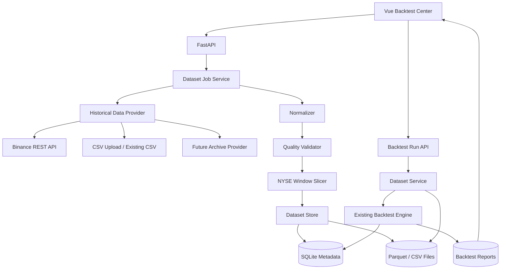

# QuietGrid 在线历史数据接入与可复现回测改造设计方案

> **文档版本**：v1.0  
> **目标版本**：QuietGrid v2.1  
> **日期**：2026-07-17  
> **适用仓库**：`cuteyuchen/QuietGrid`  
> **文档性质**：软件设计说明，不构成投资建议

---

## 目录

1. [背景与现状](#1-背景与现状)
2. [改造目标与非目标](#2-改造目标与非目标)
3. [核心设计原则](#3-核心设计原则)
4. [总体架构](#4-总体架构)
5. [数据源抽象设计](#5-数据源抽象设计)
6. [Binance 在线数据源](#6-binance-在线数据源)
7. [数据标准化与质量校验](#7-数据标准化与质量校验)
8. [数据缓存、冻结与可复现性](#8-数据缓存冻结与可复现性)
9. [NYSE 休市窗口切分](#9-nyse-休市窗口切分)
10. [数据库设计](#10-数据库设计)
11. [后端 API 设计](#11-后端-api-设计)
12. [回测执行链路改造](#12-回测执行链路改造)
13. [前端页面设计](#13-前端页面设计)
14. [配置设计](#14-配置设计)
15. [错误处理、限流与安全](#15-错误处理限流与安全)
16. [测试方案](#16-测试方案)
17. [文件级改造清单](#17-文件级改造清单)
18. [开发阶段与迁移计划](#18-开发阶段与迁移计划)
19. [验收标准](#19-验收标准)
20. [已知边界与后续演进](#20-已知边界与后续演进)

---

# 1. 背景与现状

## 1.1 当前实现

QuietGrid 当前回测功能已经具备以下能力：

- `strategy/backtest.py` 中的 `run_grid_backtest(...)` 接收标准化后的 `list[dict]` K 线；
- 支持 `L0_CONSERVATIVE` 保守成交模型；
- 支持同一根 K 线中风控优先、成交数量上限、概率成交、手续费、滑点、资金费、库存使用率、最大回撤等计算；
- 支持未来数据时间顺序检查、Walk-Forward、Monte Carlo、样本冻结及报告持久化；
- `api.py` 已提供：
  - `GET /api/v2/backtests/datasets`
  - `GET /api/v2/backtests`
  - `POST /api/v2/backtests`
- 前端 `BacktestsPage.vue` 已支持选择本地数据集并发起回测。

当前限制主要位于**数据加载层**：

1. `GET /api/v2/backtests/datasets` 仅扫描 `dataset_dir` 中的 `*.csv`；
2. `_resolve_backtest_dataset(...)` 强制要求文件后缀为 `.csv`；
3. `_execute_v2_backtest(...)` 依赖 `trader._read_backtest_csv` 与 `_run_backtest_csv`；
4. 用户必须提前手工准备 CSV，前端无法在线选择标的、时间范围并下载数据；
5. 回测报告缺少完整的数据来源、下载时间、校验结果与哈希信息。

因此，本次改造应当集中在：

> **新增统一历史数据源层、数据集管理层和线上下载流程，保持回测撮合核心尽量不变。**

---

# 2. 改造目标与非目标

## 2.1 改造目标

### G1：支持多种历史数据来源

首期支持：

- Binance USDⓈ-M Futures 在线 K 线；
- 本地冻结数据集；
- 用户上传 CSV；
- 兼容现有 `data/backtests/*.csv`。

后续可扩展：

- Binance 公共归档文件；
- 标记价格 K 线；
- 指数价格 K 线；
- 历史资金费率；
- 第三方历史盘口或逐笔成交数据。

### G2：线上获取后必须冻结

在线下载的数据不得只存在内存中。系统必须：

1. 下载；
2. 校验；
3. 标准化；
4. 保存；
5. 计算哈希；
6. 生成 `dataset_id`；
7. 再交给回测引擎。

这样同一份报告可以重新运行并得到一致的输入数据。

### G3：回测引擎与数据源解耦

`strategy/backtest.py` 不直接访问网络，不依赖 Binance SDK，也不负责读 CSV。

理想调用形式：

```python
dataset = dataset_service.load(dataset_id)
result = run_grid_backtest(
    params=grid_params,
    klines=dataset.rows,
    current_price=dataset.rows[0]["open"],
    config=backtest_config,
)
```

### G4：支持 QuietGrid 专属休市窗口回测

下载完整时间范围后，复用 NYSE 日历与强制离场规则，把数据切分为独立休市窗口：

```text
完整 K 线范围
→ NYSE 日历切窗
→ 每个窗口独立观察
→ 独立生成网格
→ 独立回测
→ 盘前缓冲时点强制结束
→ 汇总所有窗口
```

### G5：前端可视化数据获取状态

前端需要展示：

- 数据来源；
- 标的和周期；
- 时间范围；
- 预计 K 线数量；
- 下载进度；
- 缺失、重复、异常 K 线数量；
- 数据哈希；
- 是否已缓存；
- 是否完成休市窗口切分；
- 是否适合开始回测。

## 2.2 非目标

本次不实现：

- 使用 1 分钟 K 线精确模拟真实 Maker 排队顺序；
- L2/L3 订单簿历史回测；
- 自动寻找最优参数并直接用于实盘；
- 在线数据下载完成后自动扩大杠杆；
- 用网络请求替代冻结数据进行不可复现的即时回测；
- 直接重写现有 Grid 撮合算法。

---

# 3. 核心设计原则

## 3.1 Online Fetch, Local Freeze, Deterministic Replay

线上接口只负责获取数据，正式回测只读取冻结数据集。

```text
Online Provider
      ↓
Download Job
      ↓
Normalize + Validate
      ↓
Frozen Dataset + Metadata + Checksum
      ↓
Backtest Engine
```

## 3.2 数据来源与回测核心分离

数据源层回答：

> 从哪里获取数据，如何分页、重试和缓存？

回测核心回答：

> 给定严格按时间排列的已闭合 K 线，策略表现如何？

两者不得相互依赖。

## 3.3 失败关闭而不是静默降级

以下任一情况应阻止正式回测：

- 时间戳逆序；
- OHLC 不合法；
- 数据集哈希不一致；
- 数据源返回其他标的；
- K 线周期不一致；
- 缺失比例超过阈值；
- 仍包含未闭合 K 线；
- OOS 数据集参数未冻结；
- NYSE 窗口无法可靠计算。

系统不得静默填充或偷偷忽略严重错误。

## 3.4 所有输入必须可审计

每次回测需要保存：

- `dataset_id`
- Provider
- Endpoint 类型
- Symbol
- Interval
- 请求起止时间
- 实际数据起止时间
- 下载时间
- 数据条数
- 数据哈希
- 质量报告
- 窗口切分规则版本
- 参数版本
- Git commit
- 回测模型版本

---

# 4. 总体架构



## 4.1 推荐目录结构

```text
QuietGrid/
├── data_sources/
│   ├── __init__.py
│   ├── base.py
│   ├── models.py
│   ├── registry.py
│   ├── csv_source.py
│   ├── binance_source.py
│   ├── normalizer.py
│   ├── validator.py
│   ├── window_slicer.py
│   ├── cache.py
│   └── service.py
├── strategy/
│   └── backtest.py              # 保持网络无关
├── db/
│   ├── database.py
│   ├── repository.py
│   └── migrations/
│       └── 00x_backtest_datasets.sql
├── frontend/src/
│   ├── pages/BacktestsPage.vue
│   ├── components/backtest/
│   │   ├── DataSourcePicker.vue
│   │   ├── OnlineDataForm.vue
│   │   ├── DatasetQualityCard.vue
│   │   ├── DatasetJobProgress.vue
│   │   └── DatasetList.vue
│   └── api.ts
├── api.py
└── tests/
    ├── test_binance_historical_source.py
    ├── test_dataset_validator.py
    ├── test_window_slicer.py
    ├── test_dataset_api.py
    └── test_backtest_online_integration.py
```

---

# 5. 数据源抽象设计

## 5.1 统一接口

```python
from abc import ABC, abstractmethod
from collections.abc import AsyncIterator
from datetime import datetime
from typing import Any

class HistoricalDataSource(ABC):
    provider_id: str

    @abstractmethod
    async def list_symbols(self) -> list[str]:
        """返回当前数据源支持的标的。"""

    @abstractmethod
    async def preview(
        self,
        symbol: str,
        interval: str,
        start_time: datetime,
        end_time: datetime,
    ) -> "DatasetPreview":
        """不下载全部数据，只返回预估规模和可用性。"""

    @abstractmethod
    async def fetch_klines(
        self,
        symbol: str,
        interval: str,
        start_time: datetime,
        end_time: datetime,
    ) -> AsyncIterator[list[dict[str, Any]]]:
        """分页流式返回原始 K 线批次。"""
```

使用 `AsyncIterator` 而不是一次返回完整列表，避免大范围 1 分钟数据占用过多内存。

## 5.2 数据源注册表

```python
class HistoricalDataSourceRegistry:
    def __init__(self) -> None:
        self._providers: dict[str, HistoricalDataSource] = {}

    def register(self, source: HistoricalDataSource) -> None:
        if source.provider_id in self._providers:
            raise ValueError(f"重复数据源: {source.provider_id}")
        self._providers[source.provider_id] = source

    def get(self, provider_id: str) -> HistoricalDataSource:
        try:
            return self._providers[provider_id]
        except KeyError as exc:
            raise ValueError(f"不支持的数据源: {provider_id}") from exc
```

API 请求只能使用注册表中的 Provider，不允许用户传入任意 URL，避免 SSRF。

## 5.3 核心模型

```python
@dataclass(frozen=True)
class DatasetRequest:
    provider: str
    symbol: str
    interval: str
    requested_start: datetime
    requested_end: datetime
    price_type: str = "contract"
    include_funding: bool = False
    window_mode: str = "NYSE_CLOSED_ONLY"

@dataclass(frozen=True)
class NormalizedKline:
    open_time: int
    close_time: int
    open: float
    high: float
    low: float
    close: float
    volume: float
    quote_volume: float | None = None
    trade_count: int | None = None

@dataclass(frozen=True)
class DatasetQualityReport:
    input_rows: int
    output_rows: int
    duplicate_rows: int
    invalid_ohlc_rows: int
    missing_bar_count: int
    missing_ratio: float
    unclosed_rows: int
    first_open_time: int | None
    last_close_time: int | None
    warnings: tuple[str, ...]
    valid: bool
```

---

# 6. Binance 在线数据源

## 6.1 首期接口

默认使用 USDⓈ-M Futures K 线接口：

```text
GET /fapi/v1/klines
```

请求参数：

- `symbol`
- `interval`
- `startTime`
- `endTime`
- `limit`

官方接口单次最多返回 1500 根 K 线，因此必须分页。

## 6.2 支持的数据类型

```text
contract  → 合约成交价 K 线
mark      → 标记价格 K 线
index     → 指数价格 K 线
```

首期必须实现 `contract`，`mark` 和 `index` 可以作为第二阶段。

资金费率单独获取，不应伪装成 K 线字段：

```text
Kline Dataset
Funding Dataset
      ↓
按 fundingTime 对齐
      ↓
Backtest Cost Model
```

## 6.3 分页算法

```python
INTERVAL_MS = {
    "1m": 60_000,
    "3m": 180_000,
    "5m": 300_000,
    "15m": 900_000,
    "30m": 1_800_000,
    "1h": 3_600_000,
}

async def fetch_klines(...):
    cursor = start_ms

    while cursor < end_ms:
        batch = await request(
            symbol=symbol,
            interval=interval,
            startTime=cursor,
            endTime=end_ms,
            limit=1500,
        )

        if not batch:
            break

        yield batch

        last_open_time = int(batch[-1][0])
        next_cursor = last_open_time + INTERVAL_MS[interval]

        if next_cursor <= cursor:
            raise RuntimeError("分页游标未前进，终止下载。")

        cursor = next_cursor
```

## 6.4 请求重试

只对可恢复错误重试：

| 类型 | 策略 |
|---|---|
| 网络超时 | 指数退避重试 |
| HTTP 429 | 读取 `Retry-After`，暂停后重试 |
| HTTP 418 | 立即停止 Provider，记录严重告警 |
| HTTP 5xx | 有限次数重试 |
| HTTP 4xx 参数错误 | 不重试，直接失败 |
| 空批次 | 正常结束 |
| JSON 格式异常 | 失败，不继续写入数据集 |

建议：

```yaml
max_retries: 5
base_backoff_seconds: 0.5
max_backoff_seconds: 30
page_pause_seconds: 0.10
```

## 6.5 时间处理

- API 层只接受带时区 ISO 8601；
- 内部统一转换为 UTC 毫秒；
- 数据集文件中使用 Unix 毫秒；
- 展示层再转换为用户时区；
- 必须删除当前仍未闭合的 K 线。

判断已闭合：

```python
row["close_time"] < now_utc_ms
```

对于历史请求，仍建议检查该条件，避免结束时间落在当前 Bar 内。

## 6.6 标的校验

下载前先读取交易所 `exchangeInfo` 或现有 Exchange Adapter 的 symbol 信息：

- 标的是否存在；
- 是否为 `TRADING`；
- 是否属于预期市场；
- 是否支持请求周期；
- 历史起点是否晚于用户请求起点。

如果 TradFi 美股代币不出现在测试网，不应自动替换成 BTC；前端需明确标注：

```text
目标标的不可用
原因：当前环境为测试网，测试网不提供该合约
```

---

# 7. 数据标准化与质量校验

## 7.1 标准格式

```json
{
  "open_time": 1720000000000,
  "close_time": 1720000059999,
  "open": 100.0,
  "high": 100.2,
  "low": 99.9,
  "close": 100.1,
  "volume": 1234.5,
  "quote_volume": 123456.7,
  "trade_count": 338
}
```

## 7.2 校验顺序

1. 字段存在；
2. 类型转换；
3. 有限数校验；
4. 正数校验；
5. OHLC 关系校验；
6. 时间边界校验；
7. 排序；
8. 去重；
9. 周期连续性检查；
10. 未闭合 K 线剔除；
11. 数据范围与请求范围对比；
12. 生成质量报告。

OHLC 关系：

```python
high >= max(open, close)
low <= min(open, close)
high >= low
```

## 7.3 重复处理

以 `open_time` 作为唯一键。

处理原则：

- 内容完全一致：保留一条，记录重复数量；
- 同一 `open_time` 内容不同：数据集失败，不自动选择其中一条。

## 7.4 缺失 K 线

不得默认插值生成虚假 OHLC。

建议分级：

```yaml
warning_missing_ratio: 0.001
reject_missing_ratio: 0.01
```

- 缺失比例小于警告阈值：允许，但报告中标注；
- 介于警告和拒绝阈值：默认阻止 OOS_FROZEN，开发样本可手动确认；
- 超过拒绝阈值：数据集无效；
- 连续缺失超过指定根数：无论总体比例如何都阻止。

## 7.5 数据质量状态

```text
CREATED
DOWNLOADING
NORMALIZING
VALIDATING
READY
READY_WITH_WARNINGS
FAILED
DELETED
```

---

# 8. 数据缓存、冻结与可复现性

## 8.1 文件格式

推荐主格式：**Parquet**

原因：

- 体积小；
- 加载快；
- 类型稳定；
- 适合 1 分钟长周期数据；
- 便于未来增加列。

兼容格式：

- CSV：旧数据和用户上传；
- JSON：只存元数据，不存大量 K 线。

如果暂时不增加 `pyarrow`，第一阶段可以继续保存标准化 CSV，但接口与元数据设计必须允许后续切换为 Parquet。

## 8.2 存储目录

```text
data/backtests/
├── datasets/
│   ├── binance/
│   │   └── BCHUSDT/
│   │       └── 1m/
│   │           ├── ds_xxx.parquet
│   │           └── ds_xxx.metadata.json
│   └── uploads/
├── staging/
├── reports/
└── jobs/
```

下载先进入 `staging`，只有校验成功后才原子移动至 `datasets`。

## 8.3 Dataset ID

```text
ds_{provider}_{symbol}_{interval}_{start}_{end}_{hash12}
```

例如：

```text
ds_binance_BCHUSDT_1m_20260601_20260701_a83f13d4c912
```

哈希输入应包含：

- 标准化数据内容；
- Schema 版本；
- Provider；
- Symbol；
- Interval；
- 实际起止时间。

不要只对文件名计算哈希。

## 8.4 内容哈希

推荐 `BLAKE2b-256` 或 SHA-256。

```python
checksum = blake2b(canonical_bytes, digest_size=32).hexdigest()
```

读取冻结数据集时重新校验哈希。若不一致，禁止回测并将数据集标记为 `CORRUPTED`。

## 8.5 不可变规则

`READY` 后：

- 数据文件不可覆盖；
- 元数据不可原地修改；
- 重新下载产生新 `dataset_id`；
- 删除使用软删除或显式操作；
- OOS_FROZEN 报告引用的数据集不得自动清理。

---

# 9. NYSE 休市窗口切分

## 9.1 必要性

QuietGrid 的核心假设不是“任何时间都适合网格”，而是：

> 只在美股真实市场休市且距盘前强制离场仍有足够时间时运行。

因此线上下载后必须支持两种回测模式：

```text
RAW_RANGE
NYSE_CLOSED_ONLY
```

默认使用 `NYSE_CLOSED_ONLY`。

## 9.2 切分流程


## 9.3 单窗口定义

```python
@dataclass(frozen=True)
class BacktestWindow:
    window_id: str
    market_close: datetime
    force_close_at: datetime
    rows: tuple[NormalizedKline, ...]
    observation_rows: int
    tradable_rows: int
```

## 9.4 边界处理

- 半日市必须依据交易日历；
- 夏令时由时区库处理；
- 强制离场后的 K 线不得进入执行阶段；
- 连续节假日视为一个长窗口或按策略配置切分；
- 数据不足观察期时跳过该窗口；
- 同一数据集可记录多个窗口及各自质量报告。

---

# 10. 数据库设计

现有 `backtest_runs` 和 `backtest_metrics` 保留，新增以下表。

## 10.1 `backtest_datasets`

```sql
CREATE TABLE IF NOT EXISTS backtest_datasets (
    dataset_id              TEXT PRIMARY KEY,
    provider                TEXT NOT NULL,
    symbol                  TEXT NOT NULL,
    interval                TEXT NOT NULL,
    price_type              TEXT NOT NULL DEFAULT 'contract',

    requested_start         DATETIME NOT NULL,
    requested_end           DATETIME NOT NULL,
    actual_start            DATETIME,
    actual_end              DATETIME,

    storage_format          TEXT NOT NULL,
    storage_path            TEXT NOT NULL,
    metadata_path           TEXT,
    checksum_algorithm      TEXT NOT NULL,
    checksum                TEXT NOT NULL,

    row_count               INTEGER NOT NULL DEFAULT 0,
    status                  TEXT NOT NULL,
    quality_status          TEXT NOT NULL,
    quality_report_json     TEXT NOT NULL,

    window_mode             TEXT NOT NULL DEFAULT 'NYSE_CLOSED_ONLY',
    window_count            INTEGER NOT NULL DEFAULT 0,
    schema_version          TEXT NOT NULL,
    provider_version        TEXT,
    downloaded_at           DATETIME,
    created_at              DATETIME NOT NULL,
    deleted_at              DATETIME
);

CREATE INDEX IF NOT EXISTS idx_backtest_datasets_lookup
ON backtest_datasets(provider, symbol, interval, actual_start, actual_end);
```

## 10.2 `backtest_dataset_jobs`

```sql
CREATE TABLE IF NOT EXISTS backtest_dataset_jobs (
    job_id                  TEXT PRIMARY KEY,
    dataset_id              TEXT,
    provider                TEXT NOT NULL,
    request_json            TEXT NOT NULL,

    status                  TEXT NOT NULL,
    progress_pct            REAL NOT NULL DEFAULT 0,
    downloaded_rows         INTEGER NOT NULL DEFAULT 0,
    estimated_rows          INTEGER,
    current_page            INTEGER NOT NULL DEFAULT 0,

    started_at              DATETIME,
    completed_at            DATETIME,
    error_code              TEXT,
    error_message           TEXT,
    created_at              DATETIME NOT NULL,

    FOREIGN KEY(dataset_id) REFERENCES backtest_datasets(dataset_id)
);
```

## 10.3 `backtest_dataset_windows`

```sql
CREATE TABLE IF NOT EXISTS backtest_dataset_windows (
    id                      INTEGER PRIMARY KEY AUTOINCREMENT,
    dataset_id              TEXT NOT NULL,
    window_key              TEXT NOT NULL,
    window_start            DATETIME NOT NULL,
    force_close_at          DATETIME NOT NULL,
    row_start_index         INTEGER NOT NULL,
    row_end_index           INTEGER NOT NULL,
    observation_rows        INTEGER NOT NULL,
    tradable_rows           INTEGER NOT NULL,
    skip_reason             TEXT,

    UNIQUE(dataset_id, window_key),
    FOREIGN KEY(dataset_id) REFERENCES backtest_datasets(dataset_id)
);
```

## 10.4 扩展 `backtest_runs`

建议增加：

```sql
ALTER TABLE backtest_runs ADD COLUMN dataset_id TEXT;
ALTER TABLE backtest_runs ADD COLUMN dataset_checksum TEXT;
ALTER TABLE backtest_runs ADD COLUMN data_provider TEXT;
ALTER TABLE backtest_runs ADD COLUMN window_mode TEXT;
ALTER TABLE backtest_runs ADD COLUMN dataset_schema_version TEXT;
```

SQLite 迁移需逐列检查，保证重复执行安全。

---

# 11. 后端 API 设计

## 11.1 Provider 列表

```http
GET /api/v2/backtest-data/providers
```

响应：

```json
{
  "items": [
    {
      "id": "binance",
      "name": "Binance USDⓈ-M Futures",
      "supports_online": true,
      "price_types": ["contract", "mark", "index"],
      "intervals": ["1m", "3m", "5m", "15m", "30m", "1h"]
    },
    {
      "id": "local",
      "name": "本地数据集",
      "supports_online": false
    }
  ]
}
```

## 11.2 在线标的查询

```http
GET /api/v2/backtest-data/providers/binance/symbols
```

支持参数：

```text
query=AAPL
market=usds_m
```

不得由前端自由传 URL。

## 11.3 数据预览

```http
POST /api/v2/backtest-data/preview
```

请求：

```json
{
  "provider": "binance",
  "symbol": "BCHUSDT",
  "interval": "1m",
  "price_type": "contract",
  "start_time": "2026-06-01T00:00:00Z",
  "end_time": "2026-07-01T00:00:00Z",
  "window_mode": "NYSE_CLOSED_ONLY",
  "include_funding": false
}
```

响应：

```json
{
  "available": true,
  "estimated_rows": 43200,
  "estimated_pages": 29,
  "cached_dataset_id": null,
  "estimated_window_count": 5,
  "warnings": []
}
```

Preview 不下载完整数据，只做参数、标的和缓存检查。

## 11.4 创建下载任务

```http
POST /api/v2/backtest-data/jobs
```

返回 `202 Accepted`：

```json
{
  "job_id": "job_17f...",
  "status": "QUEUED"
}
```

## 11.5 查询下载任务

```http
GET /api/v2/backtest-data/jobs/{job_id}
```

```json
{
  "job_id": "job_17f...",
  "status": "DOWNLOADING",
  "progress_pct": 48.2,
  "downloaded_rows": 20800,
  "estimated_rows": 43200,
  "current_page": 14,
  "message": "正在下载第 14/29 页"
}
```

## 11.6 数据集列表

保留当前接口路径，扩充响应：

```http
GET /api/v2/backtests/datasets
```

建议响应：

```json
{
  "items": [
    {
      "dataset_id": "ds_binance_...",
      "name": "BCHUSDT 1m 2026-06-01 ~ 2026-07-01",
      "provider": "binance",
      "symbol": "BCHUSDT",
      "interval": "1m",
      "status": "READY",
      "quality_status": "PASS",
      "row_count": 43198,
      "window_count": 5,
      "checksum": "a83f...",
      "created_at": "..."
    }
  ],
  "legacy_csv_items": []
}
```

旧 CSV 可以运行时注册为 Legacy Dataset，避免破坏兼容性。

## 11.7 数据集详情

```http
GET /api/v2/backtests/datasets/{dataset_id}
```

返回元数据、质量报告和窗口统计，不直接返回全部 K 线。

## 11.8 删除数据集

```http
DELETE /api/v2/backtests/datasets/{dataset_id}
```

限制：

- 已被 OOS_FROZEN 报告引用时拒绝；
- 正在下载或回测时拒绝；
- 必须记录审计；
- 默认软删除。

## 11.9 发起回测

现有接口继续使用：

```http
POST /api/v2/backtests
```

请求由：

```json
{
  "dataset": "example_klines.csv"
}
```

逐步迁移为：

```json
{
  "dataset_id": "ds_binance_BCHUSDT_1m_...",
  "symbol": "BCHUSDT",
  "observe_rows": 180,
  "capital": 200,
  "leverage": 1,
  "fill_model": "L0_CONSERVATIVE",
  "window_mode": "NYSE_CLOSED_ONLY",
  "sample_label": "DEVELOPMENT",
  "parameters_frozen": false
}
```

兼容期内允许 `dataset` 与 `dataset_id` 二选一，不能同时传。

---

# 12. 回测执行链路改造

## 12.1 当前链路

```text
API request
→ resolve CSV path
→ trader._read_backtest_csv
→ trader._run_backtest_csv
→ strategy.backtest
```

## 12.2 目标链路

```text
API request
→ DatasetService.resolve(dataset_id)
→ verify checksum
→ load standardized rows
→ optionally slice NYSE windows
→ BacktestOrchestrator
→ existing strategy.backtest functions
→ report + DB metrics
```

## 12.3 新增 `BacktestDatasetService`

```python
class BacktestDatasetService:
    def get(self, dataset_id: str) -> BacktestDatasetMetadata:
        ...

    def load_rows(self, dataset_id: str) -> list[dict[str, Any]]:
        metadata = self.get(dataset_id)
        verify_checksum(metadata)
        rows = read_dataset_file(metadata.storage_path)
        validate_runtime_rows(rows, metadata)
        return rows

    def load_windows(self, dataset_id: str) -> list[BacktestWindow]:
        ...
```

## 12.4 新增 `BacktestOrchestrator`

```python
class BacktestOrchestrator:
    def run(self, request: BacktestRunSpec) -> BacktestRunSummary:
        rows = self.dataset_service.load_rows(request.dataset_id)

        if request.window_mode == "NYSE_CLOSED_ONLY":
            windows = self.window_slicer.slice(rows, request.observe_rows)
        else:
            windows = [single_raw_window(rows, request.observe_rows)]

        results = []
        for window in windows:
            if window.skip_reason:
                continue
            results.append(self.run_one_window(window, request))

        return aggregate_window_results(results)
```

## 12.5 保持现有核心不变

以下函数原则上不改：

```python
run_grid_backtest(...)
walk_forward_backtest(...)
monte_carlo_backtest(...)
```

只需保证其输入仍是标准化 K 线。

## 12.6 资金费数据

第一阶段保持现有固定 `funding_rate_per_bar` 兼容。

第二阶段增加：

```python
funding_events: list[FundingEvent]
```

在真实 `funding_time` 到达时扣除，而不是平均摊到每根 Bar。

---

# 13. 前端页面设计

## 13.1 页面目标

回测页面应围绕以下用户任务设计：

1. 我想从哪里获取数据？
2. 这个标的和时间范围是否有数据？
3. 数据质量如何？
4. 是否已经下载，可以复用吗？
5. 这次回测究竟使用哪份冻结数据？
6. 回测结果是否可复现？

## 13.2 页面总体布局

```text
┌───────────────────────────────────────────────────────────────┐
│ 回测与策略验证                                      [刷新]    │
├───────────────────────────────────────────────────────────────┤
│ ① 数据准备                                                   │
│ [Binance 在线] [本地数据集] [上传 CSV]                       │
│                                                               │
│ Provider  Symbol  Interval  Price Type                         │
│ Start Time               End Time                              │
│ Window Mode: NYSE Closed Only                                 │
│                                                               │
│ [检查数据] [下载并冻结]                                       │
├───────────────────────────────────────────────────────────────┤
│ 数据预览 / 下载进度 / 质量报告                                │
├───────────────────────────────────────────────────────────────┤
│ ② 回测参数                                                   │
│ Capital  Leverage  Observe Rows  Fill Model ...                │
│ [开始回测]                                                    │
├───────────────────────────────────────────────────────────────┤
│ ③ 历史回测列表       │ ④ 选中报告                            │
└───────────────────────────────────────────────────────────────┘
```

## 13.3 数据来源选择器

### Binance 在线

字段：

- Provider：固定 `Binance USDⓈ-M Futures`
- Symbol：可搜索下拉
- Interval：默认 `1m`
- Price Type：默认 `Contract`
- Start / End：UTC 存储，本地显示
- Window Mode：默认 `NYSE 休市窗口`
- Include Funding：默认关闭，未实现时禁用并说明
- “检查数据”
- “下载并冻结”

### 本地数据集

展示：

- 名称
- Provider
- Symbol
- Interval
- 时间范围
- 条数
- 质量状态
- 数据哈希
- 创建时间

### 上传 CSV

上传后先进入校验流程，不允许直接回测。

## 13.4 Preview 卡片

```text
数据可用
预计 K 线：43,200
预计请求：29 页
预计休市窗口：5
已有缓存：否
预计下载量：约 6.2 MB

警告：
- 请求起点早于标的上线时间时，实际起点可能延后
```

## 13.5 下载进度

```text
正在下载 BCHUSDT · 1m
██████████████░░░░ 72%

已下载：31,112 / 43,200
分页：21 / 29
当前阶段：VALIDATING
[取消任务]
```

取消只能在安全阶段执行，已完成冻结后不回滚。

## 13.6 质量报告

```text
质量状态：PASS

输入行数           43,200
输出行数           43,198
重复 K 线          2
冲突重复           0
未闭合 K 线        0
缺失 K 线          2
缺失比例           0.0046%
OHLC 异常          0
休市窗口           5
可回测窗口         5
Checksum           a83f13...
```

质量不通过时，“开始回测”按钮禁用，并显示明确原因。

## 13.7 回测参数区

保留当前参数：

- Symbol
- Observe Rows
- Capital
- Leverage
- Fill Model
- Maker Fee
- Taker Fee
- Stop Slippage
- Funding Rate
- Walk-Forward
- Monte Carlo
- Sample Label
- Parameters Frozen

新增只读字段：

- Dataset ID
- Dataset Checksum
- Data Provider
- Actual Range
- Window Count
- Quality Status

## 13.8 回测历史卡片

每条记录增加：

```text
BCHUSDT · COMPLETED
Dataset: ds_binance_...
Data: 2026-06-01 ~ 2026-07-01
Windows: 5
Checksum: a83f13...
Code: 8ad7c2f
PnL: -0.63
```

## 13.9 前端状态管理

建议状态：

```ts
type DatasetJobStatus =
  | "QUEUED"
  | "DOWNLOADING"
  | "NORMALIZING"
  | "VALIDATING"
  | "FREEZING"
  | "COMPLETED"
  | "FAILED"
  | "CANCELLED"
```

进度更新优先使用现有 SSE；SSE 不可用时退回轮询。

## 13.10 `api.ts` 新增方法

```ts
listBacktestProviders()
listProviderSymbols(providerId, query?)
previewBacktestData(payload)
createBacktestDataJob(payload)
getBacktestDataJob(jobId)
listBacktestDatasets()
getBacktestDataset(datasetId)
deleteBacktestDataset(datasetId)
startBacktest(payload)
```

---

# 14. 配置设计

```yaml
backtest:
  dataset_dir: "data/backtests/datasets"
  staging_dir: "data/backtests/staging"
  report_dir: "data/backtests/reports"

  default_provider: "binance"
  storage_format: "parquet"       # parquet / csv
  schema_version: "1"

  online_data:
    enabled: true
    max_range_days_1m: 180
    max_concurrent_jobs: 1
    page_limit: 1500
    page_pause_seconds: 0.10
    request_timeout_seconds: 20
    max_retries: 5
    base_backoff_seconds: 0.5
    max_backoff_seconds: 30

  validation:
    warning_missing_ratio: 0.001
    reject_missing_ratio: 0.01
    max_consecutive_missing_bars: 5
    reject_conflicting_duplicates: true
    reject_unclosed_bars: true
    verify_checksum_on_read: true

  windowing:
    default_mode: "NYSE_CLOSED_ONLY"
    force_close_minutes: 120
    minimum_tradable_rows: 30
```

Provider 复用现有代理设置：

```yaml
proxy:
  enabled: true
  http: "socks5://127.0.0.1:7890"
  https: "socks5://127.0.0.1:7890"
```

---

# 15. 错误处理、限流与安全

## 15.1 错误码

```text
PROVIDER_UNAVAILABLE
SYMBOL_NOT_FOUND
INTERVAL_NOT_SUPPORTED
INVALID_TIME_RANGE
RANGE_TOO_LARGE
RATE_LIMITED
REMOTE_RESPONSE_INVALID
DOWNLOAD_INTERRUPTED
DATA_QUALITY_FAILED
CHECKSUM_MISMATCH
DATASET_NOT_FOUND
DATASET_IN_USE
WINDOW_CALCULATION_FAILED
```

前端展示用户可理解的信息，同时日志保留技术细节。

## 15.2 限流

- 单账户默认最多一个下载任务；
- 1m 数据最大时间范围可配置；
- 同一请求命中已有完整缓存时不重复下载；
- 不允许无限并发分页；
- 下载任务不得阻塞 FastAPI 主事件循环；
- 使用后台协程、任务队列或 `asyncio.create_task` 管理。

如果进程重启，任务状态从 `DOWNLOADING` 标记为 `INTERRUPTED`，临时文件保留供清理或恢复。

## 15.3 安全

- 公共 K 线接口通常不需要 API Key；
- 不把私钥写入数据集元数据；
- Provider URL 固定配置，不接受用户任意 URL；
- Symbol、Interval 使用白名单正则；
- 文件路径必须限制在 dataset root；
- 上传 CSV 限制大小与扩展名；
- 解压文件需防 Zip Slip；
- Web 控制台必须启用现有 Token 或网络隔离；
- 删除数据集、取消任务等操作写入审计日志。

---

# 16. 测试方案

## 16.1 单元测试

### Binance Provider

- 正常单页；
- 正常多页；
- 最后一页不足 1500；
- 空响应；
- 游标不前进；
- 429 后重试；
- 5xx 后恢复；
- 参数错误不重试；
- 未闭合 K 线过滤；
- 代理配置传递。

### Normalizer

- 字符串转浮点；
- 非法数字；
- OHLC 异常；
- 相同重复；
- 冲突重复；
- 时间逆序；
- 缺失计算；
- 时区输入。

### Cache

- 临时文件原子移动；
- 哈希一致；
- 文件被篡改；
- 重复下载命中缓存；
- 相同范围不同内容生成不同 ID。

### Window Slicer

- 普通周末；
- 节假日；
- 半日市；
- 夏令时切换；
- 观察期不足；
- 盘前缓冲截断。

## 16.2 API 测试

- Preview 成功；
- 不支持标的；
- 创建任务返回 202；
- 任务进度查询；
- 数据质量失败；
- 数据集列表兼容 Legacy CSV；
- 使用 Dataset ID 发起回测；
- Dataset ID 与 Symbol 不匹配；
- OOS_FROZEN 参数未冻结；
- 删除被引用数据集失败。

## 16.3 集成测试

使用 Mock Provider 固定返回 3 页数据：

```text
Provider
→ Job
→ Normalize
→ Validate
→ Freeze
→ Dataset DB
→ Run Backtest
→ Report DB
```

必须在 CI 中完全离线运行，避免依赖 Binance 实时可用性。

## 16.4 线上烟测

只读操作：

1. Preview；
2. 下载很短时间范围；
3. 校验数据；
4. 与手工请求前后几根 K 线比对；
5. 不触发任何交易接口。

---

# 17. 文件级改造清单

## 17.1 新增文件

```text
data_sources/base.py
data_sources/models.py
data_sources/registry.py
data_sources/binance_source.py
data_sources/csv_source.py
data_sources/normalizer.py
data_sources/validator.py
data_sources/window_slicer.py
data_sources/cache.py
data_sources/service.py
db/migrations/00x_backtest_datasets.sql

frontend/src/components/backtest/DataSourcePicker.vue
frontend/src/components/backtest/OnlineDataForm.vue
frontend/src/components/backtest/DatasetQualityCard.vue
frontend/src/components/backtest/DatasetJobProgress.vue
frontend/src/components/backtest/DatasetList.vue
```

## 17.2 修改文件

### `api.py`

- 注册 Provider；
- 增加 Preview、Job、Dataset API；
- 扩展 `GET /api/v2/backtests/datasets`；
- 修改 `POST /api/v2/backtests` 支持 `dataset_id`；
- 不再在新链路中直接调用 `_resolve_backtest_dataset`；
- 保留旧 CSV 路径兼容层。

### `strategy/backtest.py`

原则上不增加网络代码。

可能仅增加：

- 从真实资金费事件扣费的可选接口；
- 多窗口聚合结果模型；
- 数据集上下文写入报告。

### `trader.py`

- 将 `_read_backtest_csv` 的标准化逻辑迁移到 `data_sources/csv_source.py`；
- 保留 CLI 兼容封装；
- `_run_backtest_csv` 最终调用统一 Dataset/Orchestrator。

### `db/database.py`

- 创建新表；
- 安全迁移列；
- 增加索引。

### `db/repository.py`

新增：

```text
create_dataset_job
update_dataset_job
create_backtest_dataset
get_backtest_dataset
list_backtest_datasets
soft_delete_backtest_dataset
save_dataset_windows
```

### `frontend/src/pages/BacktestsPage.vue`

- 增加数据来源区域；
- 增加在线下载流程；
- 增加数据集质量信息；
- 使用 `dataset_id` 发起回测；
- 保留本地 CSV 选项。

### `frontend/src/api.ts`

- 增加新类型和 API 方法；
- `V2BacktestRunRequest` 增加 `dataset_id`；
- 保留 `dataset?: string` 兼容字段。

### `requirements.txt`

如果采用 Parquet：

```text
pyarrow>=16.0
```

---

# 18. 开发阶段与迁移计划

## Phase 1：抽象与兼容

目标：

- 建立 DataSource 接口；
- 将 CSV 读取迁移到 `CsvHistoricalDataSource`；
- 现有回测行为不变；
- 所有旧测试通过。

完成标准：

```text
旧 CSV 页面仍可运行
现有报告结构不被破坏
strategy/backtest.py 不访问文件系统
```

## Phase 2：Binance 在线下载

目标：

- Provider；
- 分页；
- 重试；
- 校验；
- 冻结；
- Dataset API。

先只支持：

```text
contract Kline
1m / 5m / 15m / 1h
```

## Phase 3：前端接入

目标：

- 在线数据表单；
- Preview；
- 下载进度；
- 质量报告；
- Dataset 选择；
- 使用 `dataset_id` 回测。

## Phase 4：休市窗口批量回测

目标：

- NYSE 切窗；
- 每窗口独立观察和网格；
- 汇总窗口分布；
- 报告展示跳过原因。

## Phase 5：资金费与高级数据

目标：

- 历史资金费事件；
- Mark Price；
- Index Price；
- Binance 公共归档数据源；
- 增量更新已有数据集。

---

# 19. 验收标准

## 19.1 功能验收

- [ ] 前端可选择 Binance 在线数据；
- [ ] 可搜索并验证标的；
- [ ] 可选择周期和时间范围；
- [ ] Preview 能返回预估数量和缓存状态；
- [ ] 下载任务可显示进度；
- [ ] 下载结果生成不可变 `dataset_id`；
- [ ] 数据集具有校验报告和哈希；
- [ ] 相同请求命中缓存；
- [ ] 回测请求使用 `dataset_id`；
- [ ] 回测报告记录 Provider 与 Checksum；
- [ ] 旧 CSV 模式仍然可用；
- [ ] 默认只回测 NYSE 休市窗口；
- [ ] 每个窗口在盘前缓冲时点结束。

## 19.2 可靠性验收

- [ ] API 超时不会产生 READY 的半成品数据集；
- [ ] 进程中断后临时文件不会被识别为正式数据；
- [ ] 数据文件篡改后回测被拒绝；
- [ ] 冲突重复 K 线被拒绝；
- [ ] 未闭合 K 线不进入数据集；
- [ ] 所有时间均为 tz-aware；
- [ ] 下载任务不阻塞其他 API；
- [ ] 单元测试和集成测试全部通过。

## 19.3 可复现性验收

给定：

```text
同一 Git commit
同一 Dataset ID
同一 Dataset Checksum
同一参数版本
同一随机种子
```

两次回测的：

- K 线输入；
- Fill 选择；
- 总收益；
- 最大回撤；
- 成交数量；
- 停止原因

必须一致。

---

# 20. 已知边界与后续演进

## 20.1 1 分钟 K 线的限制

1 分钟 OHLC 只能证明：

> 某个价格在该分钟内被触达。

不能证明：

- 你的 POST_ONLY 单是否排在队列前方；
- 触达时实际成交量是否足够；
- 当时点差；
- 盘口厚度；
- 同一根 K 线内部价格路径。

因此当前仍应标记为：

```text
L0_CONSERVATIVE
```

不得宣传为真实成交复现。

## 20.2 数据可用性

- Binance 测试网可能不提供目标 TradFi 合约；
- 不同标的历史起点不同；
- 美股代币合约规则可能变化；
- Provider 在线可用不等于历史数据完整；
- Maker 费率政策仍需单独确认，不应由历史 K 线推断。

## 20.3 推荐后续能力

- 使用 Binance 公共归档减少 REST 请求；
- 支持增量更新冻结数据集；
- 独立 Funding Dataset；
- 支持逐笔成交数据；
- 支持历史订单簿快照；
- Dataset diff；
- 数据质量周报；
- 按窗口自动生成策略稳定性报告；
- 将下载任务迁移到独立 Worker。

---

# 结论

QuietGrid 当前“只能从本地 CSV 回测”的限制并不在网格撮合核心，而在 API、数据加载和前端工作流。

正确改造方式不是让 `strategy/backtest.py` 直接请求 Binance，而是增加：

1. **统一历史数据源层**；
2. **Binance 分页下载 Provider**；
3. **标准化与严格质量校验**；
4. **不可变冻结数据集和内容哈希**；
5. **NYSE 休市窗口切分**；
6. **Dataset Job 与 Metadata 数据库**；
7. **在线数据准备前端流程**；
8. **基于 Dataset ID 的可复现回测**。

完成后，QuietGrid 将同时具备：

- 在线获取数据的便利性；
- 本地冻结输入的可复现性；
- 旧 CSV 的兼容性；
- QuietGrid 专属休市窗口验证能力；
- 清晰的数据来源与审计链路。

---

## 参考资料

- QuietGrid 仓库：`https://github.com/cuteyuchen/QuietGrid`
- Binance USDⓈ-M Futures Kline/Candlestick Data：
  `https://developers.binance.com/docs/derivatives/usds-margined-futures/market-data/rest-api/Kline-Candlestick-Data`
- Binance Mark Price Kline/Candlestick Data：
  `https://developers.binance.com/docs/derivatives/usds-margined-futures/market-data/rest-api/Mark-Price-Kline-Candlestick-Data`
- Binance Public Data：
  `https://github.com/binance/binance-public-data`
