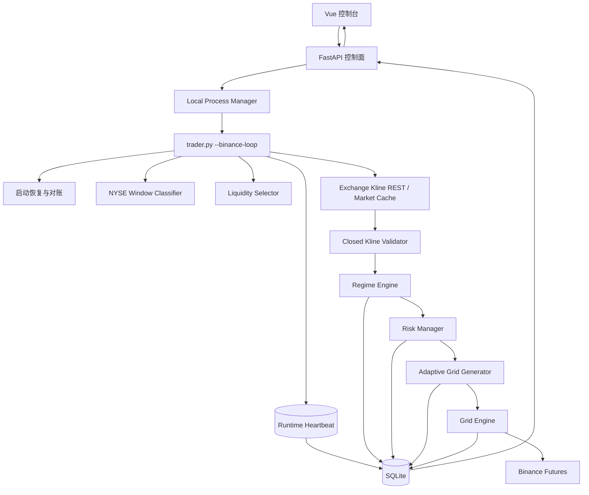
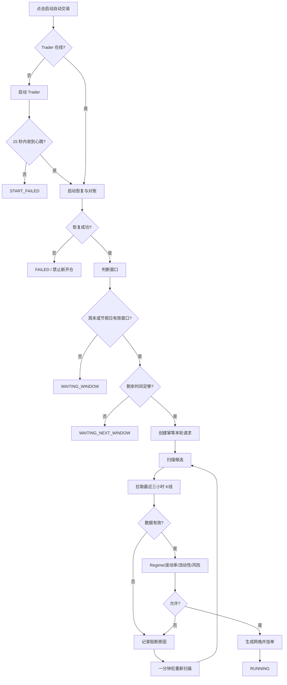

# QuietGrid v2.1 完整修改计划书  
## 网页启动、Trader 心跳、周末窗口识别、三小时 K 线预填充与自动入场

> **文档版本**：1.0  
> **目标版本**：QuietGrid v2.1  
> **基线分支**：`cuteyuchen/QuietGrid` / `master`  
> **编写日期**：2026-07-18  
> **适用环境**：Windows 本地运行、Binance Futures Testnet、后续 TradFi 实盘环境  
> **文档性质**：开发实施计划、接口约定、测试与验收基线  
> **风险声明**：本文仅描述软件工程方案，不构成投资建议。任何真实资金运行必须经过模拟盘、测试网、极小资金和人工验收。

---

## 目录

1. [执行摘要](#1-执行摘要)
2. [当前问题与根因](#2-当前问题与根因)
3. [改造目标](#3-改造目标)
4. [非目标与安全边界](#4-非目标与安全边界)
5. [关键概念与状态分层](#5-关键概念与状态分层)
6. [目标总体架构](#6-目标总体架构)
7. [完整启动流程](#7-完整启动流程)
8. [网页启动 Trader 进程](#8-网页启动-trader-进程)
9. [Trader 心跳与真实在线状态](#9-trader-心跳与真实在线状态)
10. [自动交易总开关与幂等控制](#10-自动交易总开关与幂等控制)
11. [NYSE 周末和节假日窗口识别](#11-nyse-周末和节假日窗口识别)
12. [启动后三小时 K 线预填充](#12-启动后三小时-k-线预填充)
13. [数据质量校验](#13-数据质量校验)
14. [波动率与 Regime 入场判断](#14-波动率与-regime-入场判断)
15. [符合条件后直接开始交易](#15-符合条件后直接开始交易)
16. [无可交易标的时的持续扫描](#16-无可交易标的时的持续扫描)
17. [运行数据源与回测数据源分离](#17-运行数据源与回测数据源分离)
18. [后端 API 设计](#18-后端-api-设计)
19. [数据库与控制状态设计](#19-数据库与控制状态设计)
20. [前端页面与交互设计](#20-前端页面与交互设计)
21. [配置项修改](#21-配置项修改)
22. [日志、事件与可观测性](#22-日志事件与可观测性)
23. [安全与失败关闭策略](#23-安全与失败关闭策略)
24. [文件级修改清单](#24-文件级修改清单)
25. [测试计划](#25-测试计划)
26. [开发阶段与任务拆分](#26-开发阶段与任务拆分)
27. [验收标准](#27-验收标准)
28. [迁移、发布与回滚](#28-迁移发布与回滚)
29. [最终目标运行体验](#29-最终目标运行体验)

---

# 1. 执行摘要

本次修改不是增加一个普通按钮，而是补齐 QuietGrid 从“网页可见”到“真正自动运行”的完整控制链路。

当前系统存在以下体验问题：

- 网页可以访问，但用户不知道 Trader 交易进程是否真正运行；
- 顶部 `Trader unavailable` 实际上只表示网页不能管理 systemd，并不等于 Trader 一定离线；
- 网页没有“启动 Trader”接口；
- “启动本轮”与“启动 Trader”是两件事，但页面没有区分；
- 启动请求可能留在数据库中无人消费，页面却误显示为“生成网格”；
- 当前 Scheduler 把较多非开盘时间都视为窗口，不能严格区分周末、节假日和普通工作日隔夜；
- 用户在周末启动程序时，不应再等待三小时，应立即使用最近三小时已闭合的 1 分钟 K 线完成评估；
- 若数据、波动率、Regime、流动性、成本和风险全部通过，应立即创建网格并挂单；
- 若暂无标的通过，Trader 应继续在线并按分钟重评，而不是退出或显示模糊空状态。

本计划的目标流程为：

```text
网页点击“启动自动交易”
        ↓
启动或确认 Trader 进程在线
        ↓
Trader 写入心跳并完成恢复对账
        ↓
判断是否处于 NYSE 周末/节假日有效窗口
        ├─ 否：在线等待下一窗口
        └─ 是
            ↓
扫描流动性候选
            ↓
拉取每个候选最近 182 根 1m K 线
            ↓
剔除未闭合、重复、异常数据
            ↓
取得最近连续 180 根已闭合 K 线
            ↓
波动率 + Regime + 流动性 + 成本 + 风险判断
            ├─ 不通过：记录原因，下一分钟重评
            └─ 通过
                ↓
生成 Adaptive Grid
                ↓
提交 POST_ONLY 订单
                ↓
状态进入 RUNNING
```

---

# 2. 当前问题与根因

## 2.1 网页没有真正的启动进程能力

目前后端已有：

```text
POST /api/actions/trader-loop/stop
POST /api/actions/trader-loop/restart
```

但没有：

```text
POST /api/actions/trader-loop/start
```

前端也只有“重启”和“停止”，无法在 Trader 未运行时直接启动。

## 2.2 `Trader unavailable` 含义错误

当前进程状态主要用于描述：

> Web 是否可以通过 systemd 或命令控制 Trader。

它不能可靠回答：

> Trader 交易进程此刻是否存活？

Windows 下 `process_control.mode=auto` 通常会被视为不可控制，于是页面显示 `unavailable`。即使 Trader 在另一个 PowerShell 中正常运行，网页仍可能显示不可用。

## 2.3 Trader 只注册运行实例，没有持续心跳

当前运行实例主要保存：

```text
runtime_id
started_at
```

缺少：

```text
heartbeat_at
pid
runtime_state
last_status
last_error
stopped_at
```

因此网页不能判断：

- 进程是否在线；
- 进程是否卡住；
- 启动是否成功；
- 交易循环是否正在等待窗口；
- 最后一次扫描何时发生；
- 进程是否异常退出。

## 2.4 启动本轮依赖请求，但没有自动窗口启动闭环

当前控制器会消费数据库中的 `round_start_request`。如果没有请求，即使进入窗口也可能保持等待。

这使系统更接近：

```text
人工提交启动请求
→ Trader 消费
```

而不是原始目标：

```text
Trader 在线
→ 到达周末窗口
→ 自动评估
→ 自动运行
```

## 2.5 页面阶段存在误报

当前页面可能把：

```text
数据库中存在 round_start_request
```

直接解释为：

```text
PLANNING / 生成网格
```

但实际情况可能是：

- Trader 不在线；
- 请求无人消费；
- 尚未扫描候选；
- 尚未拉取 K 线；
- 尚未产生 Regime 决策；
- 尚未生成 Grid Plan。

## 2.6 Scheduler 对“周末窗口”的定义不够严格

当前主要判断逻辑是：

```text
常规市场未开盘
且距下一次盘前超过 force_close_minutes
```

这可能把普通工作日隔夜也判为允许窗口。

QuietGrid 目标不是“美股闭市时都运行”，而是：

```text
周末长休市
或交易所节假日长休市
```

## 2.7 三小时观察的语义需要固定

正确语义：

> 启动时读取过去三小时历史数据。

错误语义：

> 启动以后再等待三小时。

当前配置 `live_observation: false` 已经接近正确方向，本次修改应把该语义固化，并在页面清楚表达“历史预填充”。

---

# 3. 改造目标

## G1：网页可启动 Trader

用户点击网页按钮即可启动：

```bash
python trader.py --binance-loop
```

Windows 环境无需手工打开第二个 PowerShell。

## G2：网页准确显示 Trader 是否在线

页面必须区分：

```text
OFFLINE
STARTING
ONLINE
STALE
STOPPING
FAILED
```

并展示 PID、运行时长和最后心跳。

## G3：区分三层状态

必须分别显示：

1. **Trader 进程状态**
2. **本轮交易状态**
3. **单标的会话状态**

不得用一个 `Trader unavailable` 覆盖所有含义。

## G4：启动自动交易后立即判断窗口

Trader 在线且恢复检查完成后：

- 判断真实 NYSE 周末或节假日窗口；
- 普通工作日隔夜不允许；
- 距强制平仓过近不允许；
- 测试强制窗口必须醒目标识。

## G5：立即拉取最近三小时 K 线

对候选标的：

- K 线周期固定为 1 分钟；
- 目标为 180 根已闭合 K 线；
- 实际请求至少 182 根；
- 去除当前未闭合 K 线；
- 检查时间连续性和数据新鲜度。

## G6：符合全部条件后直接开始交易

必须同时通过：

- 时间窗口；
- 数据质量；
- Maker 费率；
- 点差；
- 深度；
- 波动率；
- 趋势和均值回归；
- Regime；
- Inventory；
- Risk Manager；
- 距强制离场剩余时间。

## G7：不符合条件时持续评估

Trader 不退出，本轮保持：

```text
SCANNING
```

每分钟重新读取最新数据并判断。

## G8：所有关键阶段可审计

每个阶段必须写入：

- 运行状态；
- 时间；
- 标的；
- K 线数量；
- 波动率；
- Regime 分；
- 阻断原因；
- Grid Plan；
- 下单结果；
- 错误。

---

# 4. 非目标与安全边界

本次不实现：

- 根据单一波动率阈值直接无条件下单；
- 启动后自动提高杠杆；
- 使用未闭合 K 线；
- 用回测归档数据替代最新实时交易数据；
- 在 API 进程中直接执行网格交易逻辑；
- 在同一账户启动两个 Trader；
- 绕过现有 Risk Manager；
- 在接近强制离场时新建网格；
- 因为测试网 `testnet_force_window=true` 就把结果当作真实 NYSE 窗口验证；
- 在 REST 获取最新数据失败时使用陈旧数据继续下单。

---

# 5. 关键概念与状态分层

## 5.1 Trader 进程状态

```text
OFFLINE
STARTING
ONLINE
STALE
STOPPING
STOPPED
FAILED
```

定义：

| 状态 | 含义 |
|---|---|
| OFFLINE | 无可用进程且心跳超时 |
| STARTING | 已发起启动，等待首个心跳 |
| ONLINE | 心跳正常 |
| STALE | 有历史运行实例，但心跳超时 |
| STOPPING | 已发出停止命令 |
| STOPPED | 正常停止 |
| FAILED | 启动或运行异常退出 |

## 5.2 Trader 运行状态

```text
BOOTING
RECOVERING
CHECKING_WINDOW
WAITING_WINDOW
WAITING_FORCE_CLOSE
IDLE
SCANNING
RUNNING
CLOSING
ERROR
```

## 5.3 本轮状态

```text
IDLE
START_QUEUED
CHECKING_WINDOW
SCANNING
LOADING_HISTORY
EVALUATING
PLANNING
PLACING_ORDERS
RUNNING
NO_ELIGIBLE_SYMBOL
STOPPING
STOPPED
COMPLETED
FAILED
```

## 5.4 候选标的阶段

```text
DISCOVERED
DATA_LOADING
DATA_INVALID
EVALUATING
BLOCKED_WINDOW
BLOCKED_FEE
BLOCKED_LIQUIDITY
BLOCKED_VOLATILITY
BLOCKED_REGIME
BLOCKED_RISK
ELIGIBLE
PLANNING
STARTING
TRADING
STOPPED
ERROR
```

## 5.5 会话状态

继续使用现有：

```text
IDLE
OBSERVING
RUNNING
PAUSED
COOLDOWN
CLOSING
STOPPED
```

其中 `OBSERVING` 在历史预填充模式下不代表等待三小时，而代表：

> 正在使用最近三小时历史数据完成入场评估。

---

# 6. 目标总体架构



原则：

- API 只负责控制和展示；
- Trader 负责交易决策和执行；
- 所有危险动作由 Trader 消费；
- API 不直接下单；
- 进程启动与交易启动分离；
- 自动交易按钮可以编排两者，但底层状态必须独立。

---

# 7. 完整启动流程

## 7.1 普通用户流程

用户点击：

```text
启动自动交易
```

系统执行：

```text
1. 写入 auto_trading_enabled=true
2. 检查 Trader 心跳
3. Trader 离线则启动进程
4. 等待首个心跳
5. Trader 执行启动恢复
6. 判断窗口
7. 窗口有效则确保本轮启动请求存在
8. 立即扫描候选和拉取三小时数据
9. 符合条件直接挂单
10. 不符合条件则一分钟后再评估
```

## 7.2 高级运维流程

运维页面保留：

```text
启动交易进程
重启交易进程
停止交易进程
启动本轮
停止本轮
安全清扫
```

## 7.3 流程图



---

# 8. 网页启动 Trader 进程

## 8.1 新增本地进程控制模式

配置：

```yaml
process_control:
  mode: "local"
```

支持 Windows 本地启动。

## 8.2 新增 `LocalTraderProcessManager`

建议新文件：

```text
operations/process_manager.py
```

接口：

```python
@dataclass(frozen=True)
class ProcessStartResult:
    started: bool
    pid: int | None
    state: str
    message: str

class TraderProcessManager:
    def status(self, account_id: str) -> dict[str, Any]:
        ...

    def start(self, account_id: str) -> ProcessStartResult:
        ...

    def stop(self, account_id: str) -> dict[str, Any]:
        ...

    def restart(self, account_id: str) -> dict[str, Any]:
        ...
```

## 8.3 启动命令

使用参数数组，不拼接 Shell 字符串：

```python
command = [
    python_executable,
    trader_entry,
    "--binance-loop",
    "--account-id",
    account_id,
]
```

Windows：

```python
creationflags = (
    subprocess.CREATE_NEW_PROCESS_GROUP
    | subprocess.DETACHED_PROCESS
)
```

推荐第一阶段不要完全隐藏窗口，便于查看崩溃信息。稳定后再切换为 Windows Service。

## 8.4 日志输出

```python
stdout = open(
    f"logs/trader-{account_id}.log",
    "a",
    encoding="utf-8",
)
```

`stderr` 合并到 `stdout`。

## 8.5 PID 文件

```text
data/runtime/trader-{account_id}.pid
```

内容：

```json
{
  "pid": 18432,
  "account_id": "default",
  "started_at": "...",
  "command": ["...", "--binance-loop"]
}
```

PID 只能作为辅助判断，心跳才是最终依据。

## 8.6 防止重复启动

启动前检查：

1. 心跳是否在线；
2. PID 是否存在；
3. PID 对应进程命令行是否匹配 QuietGrid Trader；
4. 是否已有 `STARTING` 操作。

若已在线：

```http
409 Conflict
```

响应：

```json
{
  "detail": "交易进程已经运行，不能重复启动。"
}
```

---

# 9. Trader 心跳与真实在线状态

## 9.1 运行实例字段

将 `trader_runtime` 从：

```json
{
  "runtime_id": "...",
  "started_at": "..."
}
```

扩展为：

```json
{
  "runtime_id": "...",
  "account_id": "default",
  "pid": 18432,
  "started_at": "...",
  "heartbeat_at": "...",
  "state": "SCANNING",
  "last_status": "no_eligible_symbol",
  "last_error": "",
  "git_commit": "...",
  "stopped_at": null
}
```

## 9.2 Repository 新增方法

```python
def register_runtime(
    self,
    runtime_id: str,
    started_at: datetime,
    *,
    pid: int,
    git_commit: str = "",
) -> dict[str, Any]:
    ...

def update_runtime_heartbeat(
    self,
    runtime_id: str,
    heartbeat_at: datetime,
    *,
    state: str,
    last_status: str = "",
    last_error: str = "",
) -> None:
    ...

def mark_runtime_stopped(
    self,
    runtime_id: str,
    stopped_at: datetime,
    *,
    state: str,
    last_error: str = "",
) -> None:
    ...
```

## 9.3 心跳频率

建议：

```yaml
heartbeat_interval_seconds: 5
heartbeat_stale_seconds: 20
heartbeat_offline_seconds: 60
```

状态判断：

```python
if no_runtime:
    OFFLINE
elif explicit_state == "FAILED":
    FAILED
elif age <= 20:
    ONLINE
elif age <= 60:
    STALE
else:
    OFFLINE
```

## 9.4 独立心跳任务

不要只在主扫描循环末尾写心跳，否则网络请求卡住时无法识别。

新增独立协程：

```python
async def heartbeat_loop():
    while not shutdown_event.is_set():
        repository.update_runtime_heartbeat(...)
        await asyncio.sleep(5)
```

## 9.5 异常退出

顶层必须捕获：

```python
try:
    await run_binance_loop(...)
except Exception as exc:
    repository.mark_runtime_stopped(
        runtime_id,
        datetime.now(timezone.utc),
        state="FAILED",
        last_error=str(exc),
    )
    raise
finally:
    ...
```

---

# 10. 自动交易总开关与幂等控制

## 10.1 新增控制状态

```text
auto_trading_control
```

结构：

```json
{
  "enabled": true,
  "requested_at": "...",
  "requested_by": "web",
  "request_id": "...",
  "mode": "AUTO_WINDOW",
  "account_id": "default"
}
```

## 10.2 自动交易按钮行为

`启动自动交易`：

1. 写 `enabled=true`；
2. 启动 Trader；
3. Trader 在线后自行检查窗口；
4. 有效窗口下确保本轮请求存在。

`停止自动交易`：

1. 写 `enabled=false`；
2. 默认只停止未来新轮次；
3. 不自动平仓；
4. 用户需要平仓时使用“停止本轮”或“安全退出”。

必须在 UI 明确说明：

```text
停止自动交易 ≠ 立即平仓
```

## 10.3 窗口幂等键

```text
window_key =
NYSE:{previous_close_iso}:{next_premarket_iso}
```

自动请求 ID：

```text
auto-round:{account_id}:{window_key}
```

同一窗口重复点击或进程重启，不允许创建两个独立轮次。

## 10.4 新增 Repository 方法

```python
def ensure_round_start_request(
    self,
    *,
    runtime_id: str,
    reason: str,
    request_id: str,
    window_key: str,
    requested_at: datetime,
) -> tuple[dict[str, Any], bool]:
    """返回 request 和 created。"""
```

---

# 11. NYSE 周末和节假日窗口识别

## 11.1 当前问题

仅用：

```text
常规市场关闭
+ 距盘前大于缓冲
```

无法区分：

- 普通工作日隔夜；
- 周末长休市；
- 节假日；
- 长周末；
- 半日市；
- 强制离场缓冲。

## 11.2 新增 `WindowKind`

```python
class WindowKind(str, Enum):
    REGULAR_OPEN = "REGULAR_OPEN"
    WEEKDAY_OVERNIGHT = "WEEKDAY_OVERNIGHT"
    WEEKEND = "WEEKEND"
    HOLIDAY = "HOLIDAY"
    FORCE_CLOSE_BUFFER = "FORCE_CLOSE_BUFFER"
```

## 11.3 新增窗口描述对象

```python
@dataclass(frozen=True)
class TradingWindow:
    kind: WindowKind
    allowed: bool
    window_key: str
    previous_market_close: datetime | None
    next_market_open: datetime | None
    next_premarket_open: datetime | None
    force_close_at: datetime | None
    minutes_to_force_close: float
    reason: str
```

## 11.4 分类方法

```python
def classify_window(
    self,
    now_utc: datetime | None = None,
    *,
    allowed_kinds: set[WindowKind] | None = None,
) -> TradingWindow:
    ...
```

## 11.5 分类原则

1. 当前处于常规交易时段：
   - `REGULAR_OPEN`
   - 禁止网格。

2. 距盘前不超过强制离场缓冲：
   - `FORCE_CLOSE_BUFFER`
   - 禁止新开仓。

3. 前后交易日日期差为 1 天：
   - `WEEKDAY_OVERNIGHT`
   - 正式策略禁止。

4. 跨周末：
   - `WEEKEND`
   - 允许。

5. 因 NYSE 节假日形成长休市：
   - `HOLIDAY`
   - 配置允许时可运行。

## 11.6 不允许使用简单星期判断

禁止仅写：

```python
now.weekday() in {5, 6}
```

因为它不能正确处理：

- 周五收盘后的窗口开始；
- 周一凌晨仍属于同一周末窗口；
- 节假日；
- 夏令时；
- 半日市。

## 11.7 时间预算

除强制离场缓冲外，新增最小实际运行时间：

```yaml
force_close_minutes: 120
minimum_trade_minutes: 120
```

允许新开仓条件：

```text
距下一次盘前时间
>
force_close_minutes + minimum_trade_minutes
```

---

# 12. 启动后三小时 K 线预填充

## 12.1 目标

Trader 在有效窗口启动后，立即对候选标的拉取：

```text
最近 3 小时
1 分钟 K 线
180 根已闭合 Bar
```

不重新等待三小时。

## 12.2 复用现有 `_analyze_round_candidate`

当前候选分析已经会根据：

```python
observe_hours * 60
min_samples
regime.long_window + 1
```

计算所需 K 线数量，并调用 Exchange Adapter。

本次应在该位置强化数据准备，而不是新建一套重复计算流程。

## 12.3 统一预填充服务

新增：

```text
strategy/market_history.py
```

接口：

```python
@dataclass(frozen=True)
class RecentKlineBatch:
    symbol: str
    interval: str
    requested_limit: int
    rows: tuple[dict[str, Any], ...]
    first_open_time: datetime
    last_close_time: datetime
    age_seconds: float
    missing_count: int
    duplicate_count: int

class RecentMarketHistoryService:
    async def load_closed_klines(
        self,
        symbol: str,
        *,
        interval: str,
        required_bars: int,
        as_of: datetime,
        buffer_bars: int = 2,
    ) -> RecentKlineBatch:
        ...
```

## 12.4 请求数量

```python
required_bars = max(
    int(observe_hours * 60),
    observer_config.min_samples,
    regime_config.long_window + 1,
)

request_limit = required_bars + buffer_bars
```

默认：

```text
required_bars = 180
buffer_bars = 2
request_limit = 182
```

## 12.5 处理顺序

```text
Exchange get_klines
→ 字段标准化
→ 按 open_time 排序
→ 去重
→ 删除未闭合 K 线
→ 检查 OHLC
→ 检查 1 分钟连续性
→ 检查最新数据年龄
→ 截取最后 180 根
```

## 12.6 未闭合 K 线

必须使用 `close_time` 或推导结束时间判断：

```python
closed = row["close_time"] < as_of_ms
```

当前分钟 Bar 不参与波动率和网格计算。

## 12.7 数据不足

若只有 179 根：

```text
禁止交易
记录 DATA_INSUFFICIENT
下一分钟重试
```

不得自动降低观察窗口。

---

# 13. 数据质量校验

## 13.1 必须校验的字段

```text
open_time
close_time
open
high
low
close
volume
```

## 13.2 OHLC 规则

```python
high >= max(open, close)
low <= min(open, close)
high >= low
open > 0
high > 0
low > 0
close > 0
```

## 13.3 时间连续性

1 分钟 K 线相邻 `open_time` 应相差：

```text
60,000 ms
```

若缺失：

- 正式实盘：阻止该标的本次评估；
- 测试模式：可配置仅告警，但默认仍阻止。

## 13.4 新鲜度

使用：

```yaml
regime.max_data_age_seconds: 90
```

若最后已闭合 K 线过期：

```text
BLOCKED_DATA_STALE
```

## 13.5 冲突重复

同一 `open_time`：

- 数据完全一致：去重并记录；
- 内容不一致：阻止评估。

## 13.6 质量结果

```python
@dataclass(frozen=True)
class RuntimeKlineQuality:
    valid: bool
    required_bars: int
    actual_bars: int
    missing_count: int
    duplicate_count: int
    conflicting_duplicate_count: int
    stale_seconds: float
    reason_codes: tuple[str, ...]
```

---

# 14. 波动率与 Regime 入场判断

## 14.1 波动率是必要条件，不是唯一条件

禁止：

```python
if volatility_ok:
    start_grid()
```

应使用：

```text
Window Gate
Data Gate
Fee Gate
Liquidity Gate
Regime Gate
Risk Gate
Inventory Gate
```

## 14.2 建议判断顺序

```text
1. 窗口
2. 强制离场剩余时间
3. 数据质量
4. Maker 费率
5. 点差和深度
6. 波动率适用性
7. 趋势和均值回归
8. Regime 综合评分
9. 账户与窗口风险
10. 库存和并发限制
```

硬阻断应先于评分。

## 14.3 波动率结果展示

每个候选保存：

```text
volatility_method
volatility_value
volatility_window
range_lower
range_upper
range_width_pct
volatility_allowed
```

## 14.4 Regime 结果

继续使用现有：

```text
grid_score
allowed
reasons
hard_blocks
component_scores
model_version
```

## 14.5 阻断原因规范

```text
WINDOW_NOT_ALLOWED
INSUFFICIENT_TIME
DATA_INSUFFICIENT
DATA_STALE
DATA_GAP
MAKER_FEE_TOO_HIGH
SPREAD_TOO_WIDE
DEPTH_TOO_LOW
VOLATILITY_TOO_LOW
VOLATILITY_EXPANDING
TREND_TOO_STRONG
REGIME_SCORE_TOO_LOW
WINDOW_RISK_EXHAUSTED
INVENTORY_LIMIT
CONCURRENCY_LIMIT
```

---

# 15. 符合条件后直接开始交易

## 15.1 复用现有链路

符合条件后继续使用：

```text
_analyze_round_candidate
→ _start_round_session
→ AdaptiveGridGenerator
→ GridEngine.start
```

不新建绕过风控的快捷接口。

## 15.2 状态顺序

```text
ELIGIBLE
→ PLANNING
→ PLACING_ORDERS
→ RUNNING
```

## 15.3 会话创建时点

建议将会话创建放在：

```text
候选已通过所有入场检查
即将生成或提交网格
```

避免为每个被阻断候选创建大量无意义 Session。

若为了审计保留 OBSERVING Session，则必须明确：

```text
OBSERVING_HISTORICAL_PREFILL
```

并在失败后及时关闭。

## 15.4 下单前再次检查

在 `GridEngine.start()` 前进行最终快照检查：

- 当前仍在允许窗口；
- 价格偏离分析价格未超过阈值；
- 最新点差仍合格；
- 风险预算未被其他会话占用；
- 新开仓未被暂停；
- Trader runtime 未收到停止信号。

## 15.5 价格漂移保护

新增：

```yaml
entry:
  max_price_drift_pct: 0.002
```

若当前价相对计算网格时价格漂移过大：

```text
重新拉取数据和计算
不使用旧 Grid Plan 下单
```

---

# 16. 无可交易标的时的持续扫描

## 16.1 Trader 不退出

没有候选通过时：

```text
round_state = SCANNING
status = NO_ELIGIBLE_SYMBOL
next_scan_at = now + 60s
```

## 16.2 每分钟增量更新

下一轮无需等待三小时，因为仍然每次使用滚动最近 180 根 K 线。

## 16.3 扫描截止

出现以下情况停止新评估：

- 进入强制离场缓冲；
- 自动交易总开关关闭；
- 窗口风险耗尽；
- 达到窗口止损次数；
- 收到停止本轮请求；
- Trader 进入 ERROR。

## 16.4 页面展示

```text
本轮已启动，暂无符合条件的标的

下一次评估：38 秒后

BCHUSDT
数据：180/180
波动率：0.31%
Regime：68
状态：未通过
原因：趋势强度过高

BTCUSDT
数据：180/180
波动率：0.16%
Regime：72
状态：未通过
原因：综合评分低于 75
```

---

# 17. 运行数据源与回测数据源分离

## 17.1 实时运行数据源

启动后三小时 K 线属于**最新运行决策数据**，应优先使用交易场所自身：

```text
Exchange Adapter / Binance Futures Kline REST
```

原因：

- 数据必须与真实下单市场一致；
- 官方 Daily/Monthly Archive 通常不是实时生成；
- 回测归档无法保证当前最近一分钟完整；
- 第三方价格可能存在基差。

若实时 K 线接口失败或返回 415：

```text
禁止新开仓
记录 PROVIDER_UNAVAILABLE
保持 Trader 在线
下一分钟或退避后重试
```

不得用陈旧归档数据直接交易。

## 17.2 回测数据源

回测继续使用：

```text
本地冻结 Dataset
→ Binance Monthly Archive
→ Binance Daily Archive
→ REST 只补最新尾部
```

默认：

```yaml
backtest.default_provider: binance_hybrid
```

## 17.3 两类 Provider 不混用

```text
RuntimeMarketDataProvider
HistoricalBacktestProvider
```

必须使用不同接口和类型，防止开发者误把回测缓存接入实盘决策。

---

# 18. 后端 API 设计

## 18.1 获取 Trader 状态

```http
GET /api/process/trader
```

响应：

```json
{
  "process_state": "ONLINE",
  "alive": true,
  "pid": 18432,
  "runtime_id": "rt_xxx",
  "runtime_state": "SCANNING",
  "started_at": "2026-07-18T03:40:00Z",
  "heartbeat_at": "2026-07-18T03:45:12Z",
  "heartbeat_age_seconds": 3.1,
  "uptime_seconds": 312,
  "last_status": "no_eligible_symbol",
  "last_error": "",
  "process_control_available": true,
  "process_control_mode": "local"
}
```

## 18.2 启动 Trader

```http
POST /api/actions/trader-loop/start
```

请求：

```json
{
  "confirm": true,
  "reason": "从网页启动交易进程",
  "request_id": "uuid"
}
```

返回：

```json
{
  "ok": true,
  "state": "STARTING",
  "pid": 18432,
  "message": "交易进程已启动，正在等待首个心跳。"
}
```

## 18.3 启动自动交易

```http
POST /api/actions/auto-trading/start
```

行为：

- 打开自动交易；
- Trader 离线则启动；
- 不直接下单；
- 返回异步状态。

响应：

```json
{
  "ok": true,
  "auto_trading_enabled": true,
  "trader_process_state": "STARTING",
  "message": "自动交易已启用，系统将在 Trader 在线后检查交易窗口。"
}
```

## 18.4 停止自动交易

```http
POST /api/actions/auto-trading/stop
```

默认：

```text
停止未来新轮次
保留现有会话继续受风控管理
```

## 18.5 启动本轮

继续保留：

```http
POST /api/actions/grid-rounds/start
```

但只用于手动调试或高级操作。

## 18.6 当前轮聚合接口

建议新增：

```http
GET /api/v2/current-round
```

响应：

```json
{
  "trader": {},
  "auto_trading": {},
  "window": {
    "kind": "WEEKEND",
    "allowed": true,
    "window_key": "...",
    "force_close_at": "...",
    "minutes_to_force_close": 1800
  },
  "round": {
    "state": "SCANNING",
    "round_id": 12,
    "last_scan_at": "...",
    "next_scan_at": "..."
  },
  "candidates": [
    {
      "symbol": "BCHUSDT",
      "stage": "BLOCKED_REGIME",
      "kline_count": 180,
      "volatility_value": 0.0031,
      "regime_score": 68,
      "allowed": false,
      "reasons": ["趋势强度过高"]
    }
  ],
  "sessions": [],
  "risk": {},
  "recent_events": []
}
```

## 18.7 错误码

```text
TRADER_ALREADY_RUNNING
TRADER_START_FAILED
TRADER_START_TIMEOUT
TRADER_NOT_RUNNING
TRADER_STALE
AUTO_TRADING_ALREADY_ENABLED
WINDOW_NOT_ALLOWED
ROUND_ALREADY_RUNNING
ROUND_REQUEST_PENDING
INSUFFICIENT_WINDOW_TIME
KLINE_PROVIDER_UNAVAILABLE
KLINE_DATA_INVALID
```

---

# 19. 数据库与控制状态设计

## 19.1 第一阶段继续使用 `control_state`

新增键：

```text
auto_trading_control
process_operation
```

扩展：

```text
trader_runtime
round_runtime
round_start_request
```

## 19.2 `trader_runtime`

```json
{
  "runtime_id": "...",
  "account_id": "default",
  "pid": 18432,
  "started_at": "...",
  "heartbeat_at": "...",
  "state": "SCANNING",
  "last_status": "",
  "last_error": "",
  "git_commit": "",
  "stopped_at": null
}
```

## 19.3 `process_operation`

```json
{
  "operation_id": "...",
  "action": "start",
  "status": "running",
  "requested_at": "...",
  "completed_at": null,
  "pid": 18432,
  "error": ""
}
```

## 19.4 `round_runtime`

扩展：

```json
{
  "runtime_id": "...",
  "current_round_id": 12,
  "round_state": "SCANNING",
  "window_key": "...",
  "window_kind": "WEEKEND",
  "round_started_at": "...",
  "last_scan_at": "...",
  "next_scan_at": "...",
  "last_status": "no_eligible_symbol"
}
```

## 19.5 候选表扩展

`round_candidates` 建议增加：

```sql
kline_required_count INTEGER
kline_actual_count INTEGER
kline_last_close_at DATETIME
kline_age_seconds REAL
kline_missing_count INTEGER
kline_quality_status TEXT
regime_score REAL
regime_allowed INTEGER
block_code TEXT
block_reasons_json TEXT
evaluation_started_at DATETIME
evaluation_completed_at DATETIME
```

若不立即迁移字段，可先将详细质量信息写入事件和 `error` JSON，但正式版本推荐结构化保存。

---

# 20. 前端页面与交互设计

## 20.1 顶栏

当前模糊的：

```text
Trader unavailable
```

改为两个 Badge：

```text
Trader ONLINE
本轮 SCANNING
```

示例：

```text
Trader OFFLINE | 本轮 IDLE
Trader STARTING | 本轮未启动
Trader ONLINE | 本轮 WAITING_WINDOW
Trader ONLINE | 本轮 SCANNING
Trader ONLINE | 本轮 RUNNING
Trader STALE | 本轮状态未知
```

## 20.2 本轮运行页主控制区

```text
┌─────────────────────────────────────────────┐
│ 自动交易：已停止                             │
│ Trader：离线                                │
│ 当前窗口：周末窗口，允许交易                 │
│ 距强制离场：31h 20m                          │
│                                             │
│ [启动自动交易]                              │
└─────────────────────────────────────────────┘
```

启动后：

```text
自动交易：已开启
Trader：在线 · PID 18432 · 心跳 3 秒前
当前阶段：正在分析候选
下一次扫描：42 秒后

[停止自动交易] [停止本轮] [安全退出]
```

## 20.3 启动进度

```text
1. 启动交易进程                 完成
2. 启动恢复和交易所对账          完成
3. 检查 NYSE 周末窗口            完成
4. 扫描候选标的                 完成
5. 获取最近三小时 K 线           进行中
6. 波动率与 Regime 评估          等待
7. 生成并提交网格               等待
```

## 20.4 候选表

列：

```text
标的
阶段
K线
数据年龄
波动率
Regime
点差
深度
结果
原因
下次评估
```

示例：

```text
BCHUSDT | 评估完成 | 180/180 | 18s | 0.31% | 68 | 0.004% | 71.7M | 禁止 | 趋势过强
BTCUSDT | 生成网格 | 180/180 | 17s | 0.16% | 79 | 0.000% | 125M | 允许 | —
```

## 20.5 运维页面

交易进程卡片：

```text
实际状态       ONLINE
PID            18432
运行时长       1h 23m
最后心跳       3 秒前
运行状态       SCANNING
最后状态       no_eligible_symbol
最后错误       —

[重启交易进程] [停止交易进程]
```

离线时：

```text
[启动交易进程]
```

## 20.6 按钮启用条件

### 启动自动交易

允许：

- API 可用；
- 无启动操作正在进行；
- 自动交易未开启。

### 启动本轮

允许：

- Trader ONLINE；
- 当前窗口允许；
- 距强制离场有足够时间；
- 无活动轮次；
- 无待处理启动请求；
- 新开仓未暂停。

禁用时必须显示具体原因。

## 20.7 生命周期显示修正

不得再使用：

```text
round_start_request 存在
→ PLANNING
```

改为：

```text
Trader 离线 + 请求存在
→ START_QUEUED / 等待 Trader

Trader 在线 + 请求 requested
→ START_QUEUED

round_state=SCANNING
→ SCANNING

存在候选 stage=DATA_LOADING
→ LOADING_HISTORY

存在候选 stage=EVALUATING
→ EVALUATING

存在候选 stage=PLANNING
→ PLANNING

正在下单
→ PLACING_ORDERS

存在活动会话
→ RUNNING
```

---

# 21. 配置项修改

推荐配置：

```yaml
timing:
  startup_auto_entry: true
  startup_observation_mode: "historical_prefill"

  observe_hours: 3
  observe_kline_interval: "1m"
  live_observation: false

  required_closed_bars: 180
  kline_fetch_buffer_bars: 2

  allowed_window_kinds:
    - "WEEKEND"
    - "HOLIDAY"

  force_close_minutes: 120
  minimum_trade_minutes: 120

  scheduler_check_minutes: 5
  startup_scan_interval_seconds: 60
  loop_interval_seconds: 10

  # 仅测试环境使用，真实窗口验收必须关闭。
  testnet_force_window: false

runtime:
  heartbeat_interval_seconds: 5
  heartbeat_stale_seconds: 20
  heartbeat_offline_seconds: 60
  startup_timeout_seconds: 15

process_control:
  mode: "local"
  python_executable: ".venv/Scripts/python.exe"
  trader_entry: "trader.py"
  trader_args:
    - "--binance-loop"
  working_directory: "."
  pid_directory: "data/runtime"
  log_directory: "logs"
  timeout_seconds: 15

entry:
  max_price_drift_pct: 0.002
  revalidate_before_place: true
```

## 21.1 测试网窗口

当前测试模式可能使用：

```yaml
testnet_force_window: true
```

页面必须显示醒目标签：

```text
强制测试窗口
```

真实周末判断验收必须设置：

```yaml
testnet_force_window: false
```

## 21.2 环境 Profile

建议拆分：

```text
config/base.yaml
config/profiles/testnet.yaml
config/profiles/tradfi-live.yaml
```

避免测试标的和真实 TradFi 标的混在同一 allowlist。

---

# 22. 日志、事件与可观测性

## 22.1 系统日志模块

新增模块名：

```text
process_manager
trader_heartbeat
auto_trading
window_classifier
runtime_kline
startup_entry
```

## 22.2 事件类型

```text
TRADER_START_REQUESTED
TRADER_STARTED
TRADER_HEARTBEAT
TRADER_STALE
TRADER_STOPPED
TRADER_FAILED

AUTO_TRADING_ENABLED
AUTO_TRADING_DISABLED

WINDOW_CLASSIFIED
ROUND_AUTO_REQUESTED
ROUND_SCAN_STARTED
RUNTIME_KLINE_LOADED
RUNTIME_KLINE_REJECTED
CANDIDATE_BLOCKED
CANDIDATE_ELIGIBLE
GRID_PLANNING_STARTED
GRID_ORDER_PLACEMENT_STARTED
GRID_STARTED
```

心跳事件不应每 5 秒全部写入 `event_store`，否则数据膨胀。心跳只更新控制状态，状态变化时再写事件。

## 22.3 指标

建议暴露：

```text
quietgrid_trader_heartbeat_age_seconds
quietgrid_trader_uptime_seconds
quietgrid_round_scan_total
quietgrid_runtime_kline_fetch_failures_total
quietgrid_candidate_blocked_total{reason=...}
quietgrid_grid_start_total
quietgrid_grid_start_failures_total
```

## 22.4 页面最近事件

本轮页面展示：

```text
03:45:00 Trader 首次心跳
03:45:02 启动恢复完成
03:45:03 窗口分类：WEEKEND
03:45:05 扫描 3 个候选
03:45:06 BCHUSDT K线 180/180
03:45:06 BCHUSDT Regime 68，禁止：趋势过强
03:45:07 BTCUSDT Regime 79，允许
03:45:08 BTCUSDT Grid Plan 已生成
03:45:09 6 个 POST_ONLY 订单已提交
```

---

# 23. 安全与失败关闭策略

## 23.1 以下情况禁止新开仓

- Trader 心跳不正常；
- 当前窗口不是 WEEKEND/HOLIDAY；
- 距强制离场不足；
- K 线不足 180 根；
- K 线不连续；
- K 线过期；
- K 线 Provider 异常；
- Maker 费率超限；
- 点差或深度不合格；
- Regime 禁止；
- Risk Manager 禁止；
- Inventory 限制；
- 价格漂移超限；
- 账户恢复或对账失败；
- 有未知交易所订单；
- 自动交易总开关关闭；
- 新开仓被暂停。

## 23.2 启动进程不等于授权交易

即使 Trader 在线，也必须等待：

```text
auto_trading_enabled=true
或手动本轮启动请求
```

## 23.3 停止进程不等于平仓

停止按钮必须二次确认并提示：

```text
停止交易进程不会自动平仓。
请先停止本轮或安全退出。
```

建议若仍有活动会话，默认拒绝直接停止，除非提供特殊管理员确认。

## 23.4 API 认证

网页包含启动进程、停止进程和交易动作。若监听非 loopback：

```text
必须配置 Token
否则启动失败
```

---

# 24. 文件级修改清单

## 24.1 新增文件

```text
operations/__init__.py
operations/process_manager.py
operations/process_models.py

strategy/market_history.py
strategy/window_models.py

frontend/src/components/runtime/TraderProcessCard.vue
frontend/src/components/runtime/AutoTradingControl.vue
frontend/src/components/runtime/StartupProgress.vue
frontend/src/components/runtime/CandidateEvaluationTable.vue

tests/test_process_manager.py
tests/test_trader_heartbeat.py
tests/test_auto_trading_control.py
tests/test_scheduler_window_classification.py
tests/test_runtime_market_history.py
tests/test_startup_auto_entry.py
tests/test_current_round_api.py
```

## 24.2 修改 `core/scheduler.py`

新增：

```text
WindowKind
TradingWindow
classify_window
current_window_key
```

调整：

```text
is_in_window
should_force_close
```

使其基于 `classify_window`，避免两套口径。

## 24.3 修改 `db/repository.py`

扩展：

```text
register_runtime
runtime_state
```

新增：

```text
update_runtime_heartbeat
mark_runtime_stopped
set_auto_trading_control
auto_trading_control
ensure_round_start_request
set_process_operation
```

## 24.4 修改 `trader.py`

- 获取 PID；
- 注册完整 runtime；
- 启动独立 heartbeat loop；
- 启动恢复完成后设置状态；
- 读取自动交易总开关；
- 有效窗口下自动确保本轮请求；
- 顶层异常写入 FAILED；
- 正常退出写入 STOPPED。

## 24.5 修改 `strategy/controller.py`

- 新增 `bootstrap_auto_entry`；
- `_analyze_round_candidate` 使用 `RecentMarketHistoryService`；
- 保存 K 线质量；
- 候选阶段细化；
- 加入窗口分类和最小运行时间；
- 下单前重新检查窗口和价格漂移；
- 无标的时保持 SCANNING；
- 不重复实现三小时等待。

## 24.6 修改 `strategy/observer.py`

- 明确 `historical_prefill` 语义；
- `live_observation=false` 不等待；
- 可逐步弃用重复的原始 K 线加载逻辑；
- 最终统一由 `RecentMarketHistoryService` 提供数据。

## 24.7 修改 `api.py`

新增：

```text
POST /api/actions/trader-loop/start
POST /api/actions/auto-trading/start
POST /api/actions/auto-trading/stop
GET  /api/v2/current-round
```

扩展：

```text
GET /api/process/trader
```

现有 stop/restart 迁移到 `TraderProcessManager`。

## 24.8 修改 `frontend/src/api.ts`

新增类型和方法：

```ts
getTraderProcess()
startTraderLoop()
stopTraderLoop()
restartTraderLoop()
startAutoTrading()
stopAutoTrading()
getCurrentRound()
```

## 24.9 修改 `frontend/src/App.vue`

- 顶部拆分 Trader 状态和本轮状态；
- 增加 `trader_start` 前端动作；
- 不再把启动请求直接映射为 PLANNING；
- SSE 监听 runtime/process 事件；
- 启动阶段短轮询。

## 24.10 修改 `CurrentRoundPage.vue`

- 主按钮改为“启动自动交易”；
- 增加启动进度；
- 增加窗口分类；
- 增加候选 K 线质量；
- 增加下次扫描倒计时；
- 显示所有阻断原因。

## 24.11 修改 `OperationsPage.vue`

- 增加启动按钮；
- 展示心跳、PID、运行时长、最后错误；
- 控制能力和实际在线状态分开显示。

## 24.12 修改 `config/config.yaml`

增加本计划中的：

```text
runtime
entry
timing.startup_auto_entry
timing.allowed_window_kinds
timing.minimum_trade_minutes
process_control.local
```

真实日历测试时关闭 `testnet_force_window`。

---

# 25. 测试计划

## 25.1 Scheduler 单元测试

- 周五收盘后分类为 WEEKEND；
- 周六分类为 WEEKEND；
- 周一盘前前仍属于 WEEKEND；
- 普通周二夜间分类为 WEEKDAY_OVERNIGHT；
- 美股节假日分类为 HOLIDAY；
- 半日市后窗口正确；
- 夏令时切换正确；
- 强制离场缓冲分类正确；
- 无时区 datetime 被拒绝。

## 25.2 K 线预填充测试

- 返回 182 根含当前未闭合 Bar，最终得到 180 根；
- 返回正好 180 根已闭合 Bar；
- 返回 179 根，阻止评估；
- 时间逆序后可正确排序；
- 完全重复去重；
- 冲突重复失败；
- 中间缺一根失败；
- 最新数据过期失败；
- OHLC 异常失败；
- Provider 415 失败关闭；
- Funding 请求失败时按既定策略处理。

## 25.3 Process Manager 测试

- 离线时成功启动；
- 已在线时拒绝重复启动；
- PID 文件陈旧；
- PID 被其他程序复用；
- 启动命令不存在；
- Python 可执行文件不存在；
- 进程立即退出；
- 15 秒无心跳启动失败；
- 正常停止；
- 有活动会话时停止被阻止；
- 重启后 runtime_id 更新。

## 25.4 心跳测试

- 首次注册；
- 正常更新；
- 20 秒后 STALE；
- 60 秒后 OFFLINE；
- 显式 FAILED 优先；
- 旧 runtime 不能覆盖新 runtime；
- 多账户互不干扰。

## 25.5 自动交易测试

- 离线点击启动自动交易；
- 在线但非窗口；
- 在线且有效周末；
- 接近强制离场；
- 同一窗口重复点击；
- 进程重启后不创建重复轮次；
- 自动交易关闭后不创建新轮次；
- 无标的通过时保持 SCANNING；
- 一分钟后候选通过并启动。

## 25.6 Controller 集成测试

使用 Mock Exchange：

```text
3 个候选
→ 180 根 K线
→ 1 个 Regime 允许
→ 2 个阻断
→ 仅 1 个创建会话和订单
```

检查：

- Regime 决策已持久化；
- K 线质量已保存；
- Grid Plan 已保存；
- 风险检查已运行；
- 订单为 POST_ONLY；
- 本轮状态为 RUNNING。

## 25.7 API 测试

- `GET /api/process/trader`；
- start 返回 STARTING；
- 首个心跳后 ONLINE；
- 重复 start 返回 409；
- auto trading start；
- current round 聚合；
- 鉴权；
- 错误码；
- 多账户。

## 25.8 前端测试

- OFFLINE 显示启动按钮；
- STARTING 显示进度；
- ONLINE 显示 PID 和心跳；
- START_QUEUED 不误报 PLANNING；
- 候选阻断原因正确；
- Failed to fetch 有明确提示；
- 按钮禁用原因可见；
- 刷新页面后状态恢复。

## 25.9 端到端测试

### 场景 A：有效周末直接启动

```text
启动自动交易
→ Trader ONLINE
→ WEEKEND
→ 180 根 K线
→ 1 个候选允许
→ 网格订单创建
```

### 场景 B：无候选通过

```text
启动自动交易
→ SCANNING
→ 无订单
→ 60 秒后重新评估
```

### 场景 C：普通工作日夜间

```text
Trader ONLINE
→ WEEKDAY_OVERNIGHT
→ WAITING_WINDOW
→ 不创建 Round/Session/Order
```

### 场景 D：接近盘前

```text
WEEKEND
→ minutes_to_force_close 不足
→ 不开仓
```

### 场景 E：数据接口异常

```text
Kline 415
→ Candidate blocked
→ Trader 保持在线
→ 无订单
```

---

# 26. 开发阶段与任务拆分

## Phase 0：建立回归基线

- 固定当前测试结果；
- 备份数据库；
- 记录当前 UI；
- 新建分支：

```text
v2.1-runtime-autostart
```

完成标准：

- 当前测试可重复；
- 不直接在 master 开发。

## Phase 1：Trader 心跳

任务：

- 扩展 runtime；
- 独立 heartbeat loop；
- API 正确显示 ONLINE/STALE/OFFLINE；
- 顶栏状态修正。

预计优先级：

```text
P0
```

## Phase 2：网页启动进程

任务：

- Local Process Manager；
- start API；
- Windows PID 和日志；
- 前端启动按钮；
- 防重复启动。

预计优先级：

```text
P0
```

## Phase 3：窗口分类

任务：

- `WindowKind`；
- 周末/节假日分类；
- 普通隔夜禁用；
- 最小运行时间；
- 测试窗口提示。

预计优先级：

```text
P0
```

## Phase 4：三小时历史预填充

任务：

- RecentMarketHistoryService；
- 182→180 已闭合 K 线；
- 连续性和新鲜度；
- Controller 接入；
- 候选质量字段。

预计优先级：

```text
P0
```

## Phase 5：自动交易总开关

任务：

- 自动交易控制状态；
- Trader 启动自动 Bootstrap；
- 窗口幂等键；
- 同一窗口防重复；
- 无候选持续扫描。

预计优先级：

```text
P0
```

## Phase 6：前端完整闭环

任务：

- 启动自动交易；
- 启动进度；
- 候选表；
- 阻断原因；
- 进程/轮次/会话三层状态；
- 本轮聚合 API。

预计优先级：

```text
P1
```

## Phase 7：数据源与结构优化

任务：

- 实时 Provider 和回测 Provider 类型隔离；
- Backtest Archive-First；
- API 和前端大文件拆分；
- 指标和运行报告。

预计优先级：

```text
P1
```

## Phase 8：测试网验收

顺序：

```text
只读验证
→ 启动/停止进程
→ 强制测试窗口
→ Mock 下单
→ Testnet POST_ONLY
→ 周末真实日历
```

## Phase 9：极小资金验收

前提：

- 所有 P0/P1 测试通过；
- 真实窗口识别通过；
- 进程崩溃恢复通过；
- 安全清扫通过；
- 1 倍；
- 单标的；
- 极小资金。

---

# 27. 验收标准

## 27.1 进程控制

- [ ] 网页可启动 Trader；
- [ ] 网页可停止和重启 Trader；
- [ ] 已在线时不能重复启动；
- [ ] 启动失败显示真实原因；
- [ ] PID、心跳和运行时长可见；
- [ ] 刷新网页后状态不丢失；
- [ ] Windows 可用；
- [ ] 控制能力不可用与 Trader 离线分开显示。

## 27.2 窗口判断

- [ ] 普通工作日隔夜不交易；
- [ ] 周末窗口允许；
- [ ] 节假日可配置允许；
- [ ] 半日市正确；
- [ ] 夏令时正确；
- [ ] 距强制离场不足时不交易；
- [ ] 强制测试窗口有明显标识。

## 27.3 三小时数据

- [ ] 启动后不等待三小时；
- [ ] 获取最近 182 根；
- [ ] 最终使用 180 根已闭合 K 线；
- [ ] 未闭合 Bar 被删除；
- [ ] 缺失 Bar 阻止交易；
- [ ] 数据过期阻止交易；
- [ ] K 线质量显示在页面；
- [ ] 失败后按分钟重试。

## 27.4 自动入场

- [ ] 窗口和数据通过后进入评估；
- [ ] 波动率通过不是唯一条件；
- [ ] Regime 和 Risk 继续拥有否决权；
- [ ] 允许的标的直接生成网格；
- [ ] POST_ONLY 订单成功后显示 RUNNING；
- [ ] 价格漂移过大重新计算；
- [ ] 同一窗口不重复启动；
- [ ] 无标的通过时保持 SCANNING。

## 27.5 页面可理解性

页面必须能回答：

```text
Trader 是否在线？
自动交易是否开启？
当前是不是周末交易窗口？
距离强制离场还有多久？
本轮是否启动？
系统当前在哪个阶段？
拉取了多少根 K 线？
为什么某标的不交易？
下一次什么时候重评？
是否已经真正挂单？
```

---

# 28. 迁移、发布与回滚

## 28.1 数据迁移

第一阶段继续使用 `control_state`，不强制新增复杂迁移。

若扩展 `round_candidates`：

1. 启动时检查列是否存在；
2. 缺失则安全 `ALTER TABLE`；
3. 迁移可重复；
4. 迁移前备份 SQLite。

## 28.2 发布步骤

```text
1. 停止 Trader
2. 安全清扫
3. 备份 data/trading.db
4. 更新代码
5. 安装依赖
6. 执行数据库迁移
7. 运行 pytest
8. 构建前端
9. 启动 API
10. 网页启动 Trader
11. 检查心跳
12. 执行只读验证
13. 使用测试窗口验收
14. 关闭 testnet_force_window
15. 等待真实周末窗口
```

## 28.3 回滚条件

出现以下任一情况立即回滚：

- 重复启动两个 Trader；
- 心跳在线但进程已死；
- 普通工作日隔夜错误开仓；
- 使用未闭合 K 线；
- 同一窗口重复创建轮次；
- 进程停止后遗留未知订单；
- 页面状态与数据库明显不一致；
- 自动交易关闭后仍创建新轮次。

## 28.4 回滚方法

- 停止自动交易；
- 停止本轮并安全清扫；
- 停止 Trader；
- 恢复数据库备份；
- 切回上一稳定提交；
- 重新运行只读验证。

---

# 29. 最终目标运行体验

用户打开网页时，不再看到含义模糊的：

```text
Trader unavailable
数据 WAITING
生成网格
```

而应看到真实、可操作、可解释的状态。

## 离线

```text
自动交易：已停止
Trader：离线
当前窗口：周末窗口，允许交易
距强制离场：31h 20m

[启动自动交易]
```

## 启动中

```text
自动交易：已开启
Trader：启动中

启动交易进程              完成
等待首个心跳              进行中
恢复和交易所对账          等待
检查周末窗口              等待
获取最近三小时 K线         等待
评估候选                  等待
```

## 正在扫描

```text
Trader：在线 · PID 18432 · 心跳 3 秒前
窗口：WEEKEND
本轮：SCANNING
下次评估：42 秒后

BTCUSDT  180/180  Regime 72  禁止：评分不足
ETHUSDT  180/180  Regime 69  禁止：趋势过强
BCHUSDT  180/180  Regime 78  允许：正在生成网格
```

## 正在运行

```text
Trader：在线
本轮：RUNNING
标的：BCHUSDT
网格：8 格
开放订单：8
库存利用率：12%
本轮盈亏：+$0.42
距强制离场：28h 10m

[暂停新开仓] [停止本轮] [安全退出]
```

---

# 结论

本次修改应作为 QuietGrid 当前最高优先级的 v2.1 修复。

核心不是“增加一个启动按钮”，而是完整解决：

```text
网页能启动
→ Trader 真实在线可知
→ 自动交易是否开启可知
→ 周末窗口判断正确
→ 启动即使用最近三小时历史数据
→ 数据和风险通过后直接交易
→ 不通过时持续重评
→ 每一步都有明确状态和原因
```

实施时必须复用现有的：

- Selector；
- Regime Engine；
- Adaptive Grid；
- Risk Manager；
- Grid Engine；
- Repository 和 Event Store。

不要创建绕过现有风控的“快速下单”旁路。最终的系统应当同时具备：

- 自动性；
- 可解释性；
- 可审计性；
- 幂等性；
- 失败关闭；
- Windows 网页运维能力；
- 周末窗口内的即时历史预填充入场。
