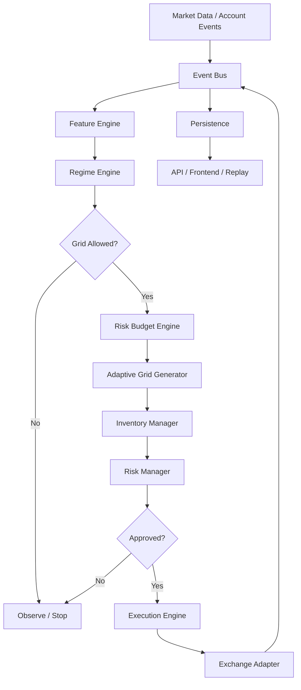
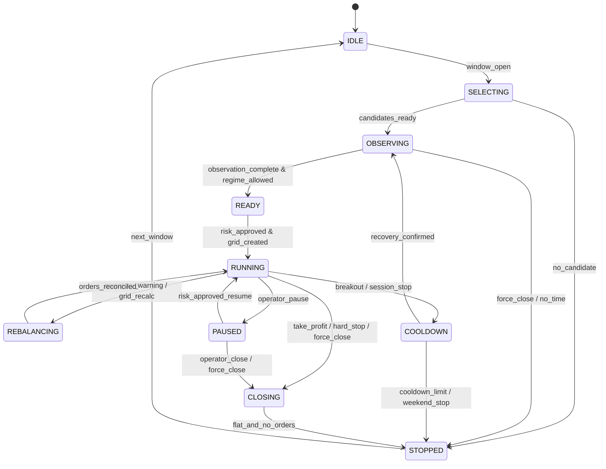

# 02. 总体架构

## 1. 架构概览



## 2. 模块职责

### 2.1 Scheduler

负责交易窗口、观察窗口、提前离场和强制关闭。Scheduler 只处理时间，不处理市场状态。

### 2.2 Exchange Adapter

统一封装 REST、WebSocket、订单、持仓、费率、交易规则和对账。所有写操作必须支持幂等 client order id。

### 2.3 Event Bus

将行情、K 线、订单、成交、账户、定时器、控制指令和风险事件统一为事件。初期可使用进程内 `asyncio.Queue`，无需立即引入 Kafka。

建议事件类型：

```text
BAR_CLOSED
TICK_UPDATED
ORDER_ACCEPTED
ORDER_REJECTED
ORDER_PARTIAL_FILLED
ORDER_FILLED
ORDER_CANCELLED
POSITION_CHANGED
FUNDING_UPDATED
REGIME_CHANGED
RISK_LIMIT_BREACHED
CONTROL_COMMAND
TIMER
```

### 2.4 Feature Engine

只负责从当前时间点可获得的数据计算特征，不做交易决策。所有特征必须带 `as_of_time` 和 `source_time`。

### 2.5 Regime Engine

输出市场状态、适配度分数和解释，不直接下单。

```python
@dataclass(frozen=True)
class RegimeDecision:
    symbol: str
    as_of: datetime
    state: str              # QUIET_RANGE / TREND / VOLATILE / ILLIQUID / EVENT_RISK
    grid_score: float       # 0..100
    allowed: bool
    reasons: list[str]
    feature_snapshot_id: int
    model_version: str
```

### 2.6 Risk Budget Engine

根据账户权益、会话风险、标的相关性、当前累计损失和 Regime Score，计算最大允许名义仓位、最大库存和单格风险。

### 2.7 Adaptive Grid Generator

根据市场与风险预算生成不可变的 `GridPlan`。它不负责下单，也不能修改账户风险上限。

### 2.8 Inventory Manager

实时维护配对库存、净仓位、平均价格、未配对成交和库存风险等级；向 Risk Manager 发出减仓或禁挂同向订单的建议。

### 2.9 Risk Manager

Risk Manager 是唯一可以批准、降级、暂停和终止策略的组件。优先级高于控制台人工“启动”命令。

### 2.10 Execution Engine

把获批的订单意图转成交易所订单，处理精度、POST_ONLY 拒单、重试、幂等、部分成交和对账。

### 2.11 Persistence / Replay

所有关键事件先形成不可变事件记录，再更新聚合表。策略重放使用事件记录而不是只依赖最终状态。

## 3. 进程与部署模型

保留当前双进程方案，但收紧职责：

```text
trader 进程
├── Event Loop
├── Exchange Adapter
├── Scheduler
├── Feature / Regime / Grid / Inventory / Risk
├── Execution
└── Event Store + Projection Writer

api 进程
├── 只读查询投影表
├── 向 control_commands 写受控指令
├── SSE 推送状态变化
└── 不直接调用交易所写接口
```

当 SQLite 写入压力增加时再迁移 PostgreSQL；v2.0 初期无需为了架构美观提前引入微服务。

## 4. 会话状态机



`COOLDOWN` 与 `CLOSING` 必须区分：冷却期意味着已经撤单并清仓、允许未来重新观察；关闭意味着本窗口不再恢复。

## 5. 建议目录结构

```text
QuietGrid/
├── app/
│   ├── events/                 # 事件定义与总线
│   ├── scheduler/
│   ├── exchange/
│   ├── features/
│   ├── regime/
│   ├── grid/
│   ├── inventory/
│   ├── risk/
│   ├── execution/
│   ├── portfolio/
│   ├── persistence/
│   └── orchestration/
├── backtest/
│   ├── engine/
│   ├── fill_models/
│   ├── datasets/
│   ├── validation/
│   └── reports/
├── api/
├── frontend/
├── config/
├── migrations/
├── tests/
│   ├── unit/
│   ├── integration/
│   ├── simulation/
│   └── fault_injection/
└── docs/
```

不必一次性移动所有现有文件。迁移时先增加接口与适配层，再逐模块替换。

## 6. 接口边界规则

1. Strategy/Regime 不可直接调用交易所。
2. Frontend 不可直接调用交易所。
3. Execution 不得自行扩大 Risk Budget。
4. Risk Manager 不负责计算 Alpha，只负责接受或拒绝风险。
5. 数据库不是交易所事实来源；恢复时以交易所状态优先。
6. 任何状态转换必须写入审计事件。
