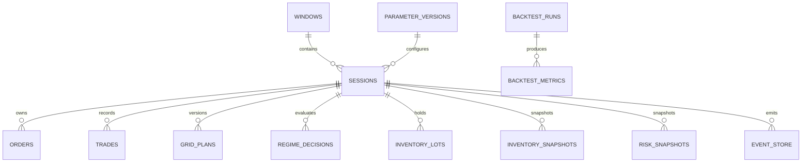

# 08. 数据模型与数据库

## 1. 原则

- 保留现有 `windows`、`sessions`、`trades`、`orders`、`state_logs`、`system_logs`、`control_state` 和候选表；
- 新增不可变事件表与状态快照表；
- 所有时间统一 UTC，展示层再转换；
- 金额与价格在应用层使用 Decimal；数据库可用 TEXT/INTEGER 定点或经过明确精度治理的 NUMERIC；
- 关键记录带 `account_id`、`strategy_version`、`config_version` 和 `code_commit`。

## 2. 新增表

### 2.1 `event_store`

```sql
CREATE TABLE event_store (
    id INTEGER PRIMARY KEY AUTOINCREMENT,
    event_id TEXT NOT NULL UNIQUE,
    account_id TEXT NOT NULL,
    session_id INTEGER,
    symbol TEXT,
    event_type TEXT NOT NULL,
    event_time TEXT NOT NULL,
    available_time TEXT NOT NULL,
    payload_json TEXT NOT NULL,
    code_commit TEXT,
    created_at TEXT NOT NULL
);
CREATE INDEX idx_event_store_session_time
ON event_store(session_id, event_time);
```

### 2.2 `feature_snapshots`

保存每次 Regime 决策所使用的特征，便于重放。

### 2.3 `regime_decisions`

```sql
CREATE TABLE regime_decisions (
    id INTEGER PRIMARY KEY AUTOINCREMENT,
    session_id INTEGER,
    symbol TEXT NOT NULL,
    as_of_time TEXT NOT NULL,
    state TEXT NOT NULL,
    grid_score REAL NOT NULL,
    allowed INTEGER NOT NULL,
    reasons_json TEXT NOT NULL,
    hard_blocks_json TEXT NOT NULL,
    model_version TEXT NOT NULL,
    feature_snapshot_id INTEGER
);
```

### 2.4 `grid_plans`

保存不可变网格计划：上下沿、中枢、间距、格数、价格与数量、成本估计、风险预算和有效期。

### 2.5 `inventory_lots`

逐笔保存未配对库存，避免只靠聚合持仓无法复现配对收益。

### 2.6 `inventory_snapshots`

周期性记录净仓位、利用率、风险分数和浮动盈亏。

### 2.7 `risk_snapshots`

记录各层风险预算的已用与剩余、触发阈值、风控动作和原因。

### 2.8 `backtest_runs` / `backtest_metrics`

保存数据区间、参数版本、成交模型、代码版本、指标和报告文件位置。

### 2.9 `parameter_versions`

配置不可直接覆盖，应保存版本：

```text
DRAFT → VALIDATED → ACTIVE → RETIRED
```

### 2.10 `control_commands` 与 `audit_logs`

将当前 `control_state` 的单值状态演进为命令队列。每个命令有状态：`PENDING / ACCEPTED / REJECTED / EXECUTED / FAILED`。

## 3. ER 关系



## 4. 写入策略

- 订单与成交事件优先写 `event_store`，再更新投影表；
- SQLite 使用 WAL、短事务和单写者队列；
- 批量写性能数据，但订单和风险事件不能延迟过久；
- 数据库写失败时，交易进程进入降级模式，禁止新增风险并告警；
- Web 只读查询投影表，避免扫描巨大事件表。

## 5. 数据保留

- 订单、成交、风险和控制审计永久保留；
- 高频特征快照可按策略重放需求压缩；
- 日志按时间轮转，但 ERROR 与事故报告长期归档；
- 每周自动备份 SQLite，并验证可恢复性。
